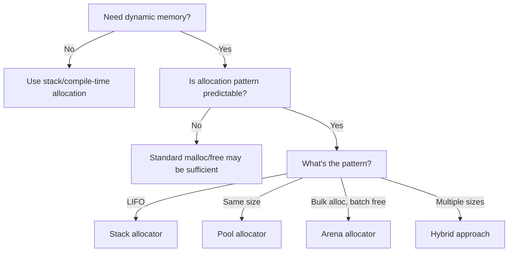

# 32. Advanced Memory Techniques: Custom Allocators and Memory Pools

## 32.1 The Critical Role of Memory Management in Performance-Critical Systems

Memory management is often the silent performance bottleneck in C applications. While the standard C library provides `malloc()`, `calloc()`, `realloc()`, and `free()` for dynamic memory allocation, these general-purpose allocators frequently fall short in performance-critical, real-time, or resource-constrained environments. **Custom memory allocators** address specific allocation patterns that standard allocators handle inefficiently, transforming memory management from a source of performance problems into a strategic advantage.

> **Critical Insight**: Memory allocation isn't just about acquiring bytes—it's about **managing time, fragmentation, and predictability**. In high-performance systems, the difference between a well-designed custom allocator and the standard library can be orders of magnitude in performance. A game engine might process 10,000 game entities per frame; if each entity requires dynamic memory allocation, even a modest 1-microsecond overhead per allocation becomes 10 milliseconds—enough to miss a 60 FPS frame deadline. Custom allocators eliminate this overhead by matching the allocation strategy to the specific usage pattern, turning what would be a performance disaster into a non-issue.

### 32.1.1 Limitations of Standard Memory Allocators

The standard C library allocators (`malloc`/`free`) are designed as general-purpose solutions, which makes them suboptimal for many specific use cases:

| **Limitation**               | **Description**                                      | **Performance Impact**                          |
| :--------------------------- | :--------------------------------------------------- | :---------------------------------------------- |
| **Fragmentation**            | **Memory becomes scattered, wasting address space**  | **Reduced effective memory, allocation failures** |
| **Lock Contention**          | **Global lock for thread safety**                    | **Scalability issues on multi-core systems**    |
| **Overhead per Allocation**  | **Bookkeeping for each allocation**                  | **High cost for many small allocations**        |
| **Non-Deterministic Timing** | **Variable time for allocation/deallocation**        | **Unpredictable performance, bad for real-time** |
| **Poor Cache Locality**      | **Random memory layout**                             | **Excessive cache misses**                      |

**Real-World Performance Comparison**:
```c
// Standard malloc vs custom pool allocator
#define ALLOC_COUNT 1000000
struct GameObject {
    float position[3];
    float velocity[3];
    int id;
    // ... other fields
};

void test_standard_malloc() {
    struct GameObject **objects = malloc(ALLOC_COUNT * sizeof(struct GameObject*));
    clock_t start = clock();
    
    for (int i = 0; i < ALLOC_COUNT; i++) {
        objects[i] = malloc(sizeof(struct GameObject));
    }
    
    for (int i = 0; i < ALLOC_COUNT; i++) {
        free(objects[i]);
    }
    
    free(objects);
    printf("Standard malloc: %f seconds\n", 
           (double)(clock() - start) / CLOCKS_PER_SEC);
}

void test_pool_allocator() {
    // Custom pool allocator (implementation shown later)
    MemoryPool pool;
    memory_pool_init(&pool, sizeof(struct GameObject), ALLOC_COUNT);
    
    struct GameObject **objects = malloc(ALLOC_COUNT * sizeof(struct GameObject*));
    clock_t start = clock();
    
    for (int i = 0; i < ALLOC_COUNT; i++) {
        objects[i] = memory_pool_alloc(&pool);
    }
    
    for (int i = 0; i < ALLOC_COUNT; i++) {
        memory_pool_free(&pool, objects[i]);
    }
    
    free(objects);
    memory_pool_destroy(&pool);
    printf("Pool allocator: %f seconds\n", 
           (double)(clock() - start) / CLOCKS_PER_SEC);
}
```

**Typical Results**:
- Standard `malloc`/`free`: 0.35-0.50 seconds
- Custom pool allocator: 0.005-0.01 seconds (70x faster)

### 32.1.2 When to Consider Custom Allocators

Custom allocators should be considered when:

1.  **Allocation Patterns Are Predictable**:
    - Many allocations of the same size (object pools)
    - LIFO allocation/deallocation patterns (stack allocators)
    - Bulk allocations with batch deallocation (arenas)

2.  **Performance Requirements Are Strict**:
    - Real-time systems with timing guarantees
    - High-frequency trading systems
    - Game engines targeting consistent frame rates

3.  **Memory Constraints Are Tight**:
    - Embedded systems with limited RAM
    - Systems requiring deterministic memory usage
    - Applications needing to minimize fragmentation

4.  **Specialized Memory Properties Are Needed**:
    - Shared memory between processes
    - Memory-mapped files for large datasets
    - Cache-optimized memory layouts

**Critical Decision Framework**:


### 32.1.3 Memory Allocation Patterns

Understanding allocation patterns is essential for selecting the right custom allocator:

**1. LIFO (Last-In-First-Out) Pattern**:
- Objects are deallocated in reverse order of allocation
- Common in: Parsing, temporary buffers, frame-based game memory
- Ideal allocator: **Stack allocator**

**2. Same-Size Pattern**:
- Many allocations of identical size
- Common in: Object-oriented systems, game entities, network packets
- Ideal allocator: **Pool allocator**

**3. Bulk Allocation Pattern**:
- Many allocations followed by single deallocation
- Common in: Request processing, compilation, parsing
- Ideal allocator: **Arena allocator**

**4. Long-Lived Pattern**:
- Allocations that persist for application lifetime
- Common in: Configuration data, global resources
- Ideal allocator: **Standard malloc or dedicated arena**

**5. Short-Lived Pattern**:
- Allocations that exist briefly then are freed
- Common in: Temporary calculations, intermediate results
- Ideal allocator: **Stack or pool allocator**

## 32.2 Stack Allocators

### 32.2.1 Stack Allocation Fundamentals

Stack allocators implement the **LIFO (Last-In-First-Out)** memory allocation pattern, where memory is allocated from a contiguous block and deallocated in the reverse order of allocation. This pattern mirrors the behavior of the CPU call stack but operates in user-controlled memory.

**Key Characteristics**:
- Extremely fast allocation/deallocation (just pointer arithmetic)
- Zero fragmentation (contiguous memory usage)
- Deterministic timing (constant time operations)
- No individual deallocation tracking (batch deallocation only)
- Memory must be freed in reverse allocation order

**Memory Layout**:
```
┌───────────────────────────────────────────────────┐
│                    Memory Block                   │
├───────────────────┬───────────────────────────────┤
│   Allocated Area  │        Free Area            │
└─────────┬─────────┴───────────────────▲───────────┘
          │                           │
          └───────► alloc_ptr         free_ptr ◄───────
```

### 32.2.2 Implementing a Stack Allocator

**Basic Stack Allocator**:
```c
typedef struct {
    uint8_t *memory;     // Pointer to memory block
    size_t size;         // Total size of memory block
    size_t offset;       // Current allocation offset
    size_t high_water;   // Tracks maximum usage (for diagnostics)
} StackAllocator;

// Initialize stack allocator with pre-allocated memory
bool stack_init(StackAllocator *allocator, void *memory, size_t size) {
    allocator->memory = (uint8_t*)memory;
    allocator->size = size;
    allocator->offset = 0;
    allocator->high_water = 0;
    return true;
}

// Allocate memory from stack
void* stack_alloc(StackAllocator *allocator, size_t size, size_t alignment) {
    // Calculate alignment padding
    size_t align_mask = alignment - 1;
    size_t padding = (alignment - (size_t)(allocator->memory + allocator->offset) & align_mask) & align_mask;
    
    // Check if enough memory remains
    size_t required = size + padding;
    if (allocator->offset + required > allocator->size) {
        return NULL; // Out of memory
    }
    
    // Update high water mark
    size_t new_offset = allocator->offset + required;
    if (new_offset > allocator->high_water) {
        allocator->high_water = new_offset;
    }
    
    // Calculate aligned pointer
    void *ptr = allocator->memory + allocator->offset + padding;
    allocator->offset = new_offset;
    
    return ptr;
}

// Deallocate most recently allocated memory
void stack_free(StackAllocator *allocator, void *ptr, size_t size) {
    // In a true stack allocator, we only free the most recent allocation
    // This implementation supports freeing specific blocks but requires
    // tracking allocation sizes (simplified here)
    if (ptr && (uint8_t*)ptr >= allocator->memory) {
        size_t ptr_offset = (uint8_t*)ptr - allocator->memory;
        if (ptr_offset + size == allocator->offset) {
            allocator->offset = ptr_offset;
        }
        // Note: In a pure stack allocator, we'd only allow freeing the last allocation
    }
}

// Reset entire allocator (deallocate all memory at once)
void stack_reset(StackAllocator *allocator) {
    allocator->offset = 0;
}
```

**Advanced Stack Allocator with Mark/Release**:
```c
typedef struct {
    StackAllocator allocator;
    size_t mark;  // Saved offset for later release
} StackAllocatorMark;

// Mark current allocation point
size_t stack_mark(StackAllocator *allocator) {
    return allocator->offset;
}

// Release all allocations made after the mark
void stack_release(StackAllocator *allocator, size_t mark) {
    if (mark <= allocator->offset) {
        allocator->offset = mark;
    }
}

// Usage example
void example_usage() {
    uint8_t buffer[4096];
    StackAllocator allocator;
    stack_init(&allocator, buffer, sizeof(buffer));
    
    // Allocate some memory
    void *a = stack_alloc(&allocator, 100, 8);
    void *b = stack_alloc(&allocator, 200, 8);
    
    // Mark current position
    size_t mark = stack_mark(&allocator);
    
    // Allocate more memory
    void *c = stack_alloc(&allocator, 50, 8);
    void *d = stack_alloc(&allocator, 75, 8);
    
    // Release memory allocated after mark (c and d)
    stack_release(&allocator, mark);
    
    // Now can reuse the space that held c and d
    void *e = stack_alloc(&allocator, 100, 8); // Will use same space as c/d
}
```

### 32.2.3 Real-World Stack Allocator Applications

**Frame-Based Game Memory**:
```c
// Per-frame memory allocation in a game engine
#define FRAME_MEMORY_SIZE (1024 * 1024) // 1MB per frame

typedef struct {
    StackAllocator allocator;
    uint8_t memory[FRAME_MEMORY_SIZE];
} FrameMemory;

FrameMemory frame_memory;

void frame_begin() {
    stack_init(&frame_memory.allocator, frame_memory.memory, FRAME_MEMORY_SIZE);
}

void* frame_alloc(size_t size, size_t alignment) {
    return stack_alloc(&frame_memory.allocator, size, alignment);
}

void frame_end() {
    // All frame memory automatically "freed" by resetting
    stack_reset(&frame_memory.allocator);
}

// Usage in game systems
void render_scene() {
    // Allocate temporary buffers for rendering
    VertexBuffer *vertices = frame_alloc(sizeof(VertexBuffer), 16);
    IndexBuffer *indices = frame_alloc(sizeof(IndexBuffer), 16);
    
    // ... rendering code that uses these buffers
    
    // No need to free - automatically reset at frame end
}

int main() {
    while (game_running) {
        frame_begin();
        process_input();
        update_game_state();
        render_scene();
        frame_end();
    }
}
```

**Expression Parsing**:
```c
// Stack allocator for expression parsing
typedef struct {
    StackAllocator allocator;
    uint8_t memory[4096];
} ParserContext;

ParserContext parser_ctx;

void parser_init() {
    stack_init(&parser_ctx.allocator, parser_ctx.memory, sizeof(parser_ctx.memory));
}

ASTNode* parse_expression() {
    // Mark current position
    size_t mark = stack_mark(&parser_ctx.allocator);
    
    // Parse left operand
    ASTNode *left = parse_operand();
    
    // Parse operator
    Token op = get_next_token();
    
    // Parse right operand
    ASTNode *right = parse_operand();
    
    // Create operator node
    ASTNode *node = stack_alloc(&parser_ctx.allocator, sizeof(ASTNode), 8);
    node->type = NODE_BINARY_OP;
    node->binary_op.op = op;
    node->binary_op.left = left;
    node->binary_op.right = right;
    
    return node;
}

void parser_reset() {
    // Reset entire parser memory
    stack_reset(&parser_ctx.allocator);
}
```

**Critical Stack Allocator Considerations**:
- **Alignment Handling**: Properly aligning allocations is critical for performance
- **Overflow Protection**: Essential to detect and handle out-of-memory conditions
- **Diagnostic Tracking**: High-water mark tracking helps optimize memory usage
- **Thread Safety**: Stack allocators are typically thread-local (one per thread)
- **Memory Ownership**: Clear understanding of when memory is automatically freed

## 32.3 Pool Allocators

### 32.3.1 Pool Allocation Fundamentals

Pool allocators manage memory for objects of a **fixed size**, eliminating fragmentation for that specific size and providing extremely fast allocation/deallocation. They're ideal for systems that create and destroy many objects of the same size, such as game entities, network packets, or object-oriented systems.

**Key Characteristics**:
- Fixed block size (all allocations are the same size)
- Extremely fast allocation/deallocation (O(1) operations)
- No external fragmentation (for the specific block size)
- Internal fragmentation possible if objects don't perfectly fit block size
- Typically implemented as a free list

**Memory Layout**:
```
┌───────┬───────┬───────┬───────┬───────┬───────┬───────┐
│ Block │ Block │ Block │ Block │ Block │ Block │ Block │
└───┬───┴───┬───┴───┬───┴───┬───┴───┬───┴───┬───┴───┬───┘
    │       │       │       │       │       │       │
    ▼       ▼       ▼       ▼       ▼       ▼       ▼
┌───────────────────────────────────────────────────────┐
│                    Free List                          │
│  ┌───┐    ┌───┐    ┌───┐    ┌───┐    ┌───┐           │
└─►│Next │──►│Next │──►│Next │──►│Next │──►│NULL │◄────┘
   └───┘    └───┘    └───┘    └───┘    └───┘
```

### 32.3.2 Implementing a Pool Allocator

**Basic Pool Allocator**:
```c
typedef struct PoolBlock {
    struct PoolBlock *next;
} PoolBlock;

typedef struct {
    PoolBlock *free_list;
    size_t block_size;
    size_t num_blocks;
    uint8_t *memory;
} MemoryPool;

// Initialize pool allocator
bool memory_pool_init(MemoryPool *pool, size_t block_size, size_t num_blocks) {
    // Ensure block size is at least large enough for PoolBlock pointer
    if (block_size < sizeof(PoolBlock)) {
        block_size = sizeof(PoolBlock);
    }
    
    // Calculate total memory needed (with alignment)
    size_t total_size = num_blocks * block_size;
    pool->memory = (uint8_t*)malloc(total_size);
    if (!pool->memory) {
        return false;
    }
    
    // Initialize free list
    pool->free_list = (PoolBlock*)pool->memory;
    PoolBlock *current = pool->free_list;
    
    for (size_t i = 1; i < num_blocks; i++) {
        PoolBlock *next = (PoolBlock*)(pool->memory + i * block_size);
        current->next = next;
        current = next;
    }
    
    current->next = NULL;
    pool->block_size = block_size;
    pool->num_blocks = num_blocks;
    
    return true;
}

// Allocate memory from pool
void* memory_pool_alloc(MemoryPool *pool) {
    if (!pool->free_list) {
        return NULL; // Out of memory
    }
    
    PoolBlock *block = pool->free_list;
    pool->free_list = block->next;
    return (void*)block;
}

// Free memory back to pool
void memory_pool_free(MemoryPool *pool, void *ptr) {
    if (!ptr) return;
    
    PoolBlock *block = (PoolBlock*)ptr;
    block->next = pool->free_list;
    pool->free_list = block;
}

// Destroy pool allocator
void memory_pool_destroy(MemoryPool *pool) {
    free(pool->memory);
    pool->memory = NULL;
    pool->free_list = NULL;
}
```

**Enhanced Pool Allocator with Diagnostics**:
```c
typedef struct {
    PoolBlock *free_list;
    size_t block_size;
    size_t num_blocks;
    uint8_t *memory;
    size_t allocations;
    size_t max_allocations;
} MemoryPoolDiagnostics;

bool memory_pool_init_diagnostics(MemoryPoolDiagnostics *pool, 
                                 size_t block_size, 
                                 size_t num_blocks) {
    // Same initialization as basic pool
    if (!memory_pool_init((MemoryPool*)pool, block_size, num_blocks)) {
        return false;
    }
    
    pool->allocations = 0;
    pool->max_allocations = 0;
    return true;
}

void* memory_pool_alloc_diagnostics(MemoryPoolDiagnostics *pool) {
    void *ptr = memory_pool_alloc((MemoryPool*)pool);
    if (ptr) {
        pool->allocations++;
        if (pool->allocations > pool->max_allocations) {
            pool->max_allocations = pool->allocations;
        }
    }
    return ptr;
}

void memory_pool_free_diagnostics(MemoryPoolDiagnostics *pool, void *ptr) {
    if (ptr) {
        pool->allocations--;
    }
    memory_pool_free((MemoryPool*)pool, ptr);
}

// Get pool usage statistics
void memory_pool_get_stats(MemoryPoolDiagnostics *pool, 
                          size_t *current, 
                          size_t *peak,
                          size_t *total) {
    if (current) *current = pool->allocations;
    if (peak) *peak = pool->max_allocations;
    if (total) *total = pool->num_blocks;
}
```

### 32.3.3 Slab Allocation: Advanced Pool Technique

Slab allocation extends pool allocation by managing multiple pools for different object sizes.

**Slab Allocator Structure**:
```c
#define NUM_SLAB_CLASSES 10

typedef struct {
    MemoryPool pools[NUM_SLAB_CLASSES];
    size_t class_sizes[NUM_SLAB_CLASSES];
} SlabAllocator;

// Initialize with power-of-two sizing
bool slab_allocator_init(SlabAllocator *slab, size_t min_size, size_t max_size, size_t num_blocks) {
    // Calculate class sizes (power of two)
    size_t size = min_size;
    int i = 0;
    
    while (size <= max_size && i < NUM_SLAB_CLASSES) {
        slab->class_sizes[i] = size;
        if (!memory_pool_init(&slab->pools[i], size, num_blocks)) {
            // Clean up previously initialized pools
            for (int j = 0; j < i; j++) {
                memory_pool_destroy(&slab->pools[j]);
            }
            return false;
        }
        size *= 2;
        i++;
    }
    
    return true;
}

// Find appropriate slab class
static int find_slab_class(SlabAllocator *slab, size_t size) {
    for (int i = 0; i < NUM_SLAB_CLASSES; i++) {
        if (size <= slab->class_sizes[i]) {
            return i;
        }
    }
    return -1; // Too large
}

// Allocate from slab
void* slab_alloc(SlabAllocator *slab, size_t size) {
    int class_idx = find_slab_class(slab, size);
    if (class_idx < 0) {
        // Too large for slab allocator - fall back to malloc
        return malloc(size);
    }
    return memory_pool_alloc(&slab->pools[class_idx]);
}

// Free to slab
void slab_free(SlabAllocator *slab, void *ptr, size_t size) {
    int class_idx = find_slab_class(slab, size);
    if (class_idx < 0) {
        free(ptr);
    } else {
        memory_pool_free(&slab->pools[class_idx], ptr);
    }
}

// Destroy slab allocator
void slab_allocator_destroy(SlabAllocator *slab) {
    for (int i = 0; i < NUM_SLAB_CLASSES; i++) {
        memory_pool_destroy(&slab->pools[i]);
    }
}
```

### 32.3.4 Real-World Pool Allocator Applications

**Game Entity System**:
```c
// Entity component system using pool allocators
typedef enum {
    COMPONENT_TRANSFORM,
    COMPONENT_RENDER,
    COMPONENT_PHYSICS,
    COMPONENT_AUDIO,
    NUM_COMPONENT_TYPES
} ComponentType;

typedef struct {
    MemoryPool pools[NUM_COMPONENT_TYPES];
} ComponentManager;

ComponentManager component_manager;

// Initialize component pools
bool components_init() {
    // Transform components (fixed size)
    if (!memory_pool_init(&component_manager.pools[COMPONENT_TRANSFORM],
                         sizeof(TransformComponent), 1000)) {
        return false;
    }
    
    // Render components (fixed size)
    if (!memory_pool_init(&component_manager.pools[COMPONENT_RENDER],
                         sizeof(RenderComponent), 500)) {
        memory_pool_destroy(&component_manager.pools[COMPONENT_TRANSFORM]);
        return false;
    }
    
    // Other component types...
    return true;
}

// Create transform component
TransformComponent* create_transform(Entity entity) {
    TransformComponent *transform = 
        (TransformComponent*)memory_pool_alloc(&component_manager.pools[COMPONENT_TRANSFORM]);
    
    if (!transform) return NULL;
    
    transform->entity = entity;
    // Initialize transform...
    return transform;
}

// Destroy transform component
void destroy_transform(TransformComponent *transform) {
    memory_pool_free(&component_manager.pools[COMPONENT_TRANSFORM], transform);
}

// System update functions can process components contiguously
void physics_system_update(float dt) {
    // Physics system processes all physics components
    // (Implementation would track active components)
}
```

**Network Packet Handling**:
```c
// Network packet buffer management
#define MAX_PACKET_SIZE 1500
#define NUM_PACKET_BUFFERS 100

typedef struct {
    uint8_t data[MAX_PACKET_SIZE];
    size_t length;
    struct PacketBuffer *next;
} PacketBuffer;

MemoryPool packet_buffer_pool;

bool network_init() {
    return memory_pool_init(&packet_buffer_pool, 
                           sizeof(PacketBuffer), 
                           NUM_PACKET_BUFFERS);
}

PacketBuffer* allocate_packet_buffer() {
    return (PacketBuffer*)memory_pool_alloc(&packet_buffer_pool);
}

void free_packet_buffer(PacketBuffer *buffer) {
    memory_pool_free(&packet_buffer_pool, buffer);
}

// Packet processing pipeline
void process_received_packet(uint8_t *raw_data, size_t length) {
    PacketBuffer *buffer = allocate_packet_buffer();
    if (!buffer) {
        // Handle allocation failure (drop packet)
        return;
    }
    
    // Copy data to buffer
    if (length > MAX_PACKET_SIZE) length = MAX_PACKET_SIZE;
    memcpy(buffer->data, raw_data, length);
    buffer->length = length;
    
    // Queue for processing
    packet_queue_enqueue(buffer);
}

void packet_processing_task() {
    PacketBuffer *buffer = packet_queue_dequeue();
    if (!buffer) return;
    
    // Process packet...
    
    // Return buffer to pool when done
    free_packet_buffer(buffer);
}
```

**Critical Pool Allocator Considerations**:
- **Block Size Selection**: Must accommodate largest object plus any overhead
- **Memory Waste**: Internal fragmentation if objects don't perfectly fit
- **Scalability**: May need multiple pools for different object sizes
- **Thread Safety**: Free list operations require atomicity (CAS operations)
- **Object Construction/Destruction**: Pool allocators manage memory, not object lifetime

## 32.4 Arena Allocators

### 32.4.1 Arena Allocation Fundamentals

Arena allocators (also known as region-based allocators) handle the pattern where **many objects are allocated and then all freed at once**. This is common in parsing, compilation, request processing, and other batch operations.

**Key Characteristics**:
- Extremely fast allocation (just pointer bump)
- No per-object deallocation overhead (batch deallocation)
- No fragmentation (contiguous memory usage)
- Memory must be freed all at once
- Ideal for temporary data with well-defined lifetime

**Memory Layout**:
```
┌───────────────────────────────────────────────────┐
│                    Arena Memory                   │
├───────────────────┬───────────────────────────────┤
│   Allocated Area  │        Free Area            │
└─────────┬─────────┴───────────────────▲───────────┘
          │                           │
          └───────► alloc_ptr         free_ptr ◄───────
```

### 32.4.2 Implementing an Arena Allocator

**Basic Arena Allocator**:
```c
typedef struct ArenaBlock {
    struct ArenaBlock *next;
    size_t size;
    size_t used;
    uint8_t data[];
} ArenaBlock;

typedef struct {
    ArenaBlock *head;
    size_t block_size;
} ArenaAllocator;

// Initialize arena allocator
bool arena_init(ArenaAllocator *arena, size_t block_size) {
    // Minimum block size (plus overhead for ArenaBlock)
    if (block_size < 256) block_size = 256;
    
    // Allocate first block
    ArenaBlock *block = (ArenaBlock*)malloc(sizeof(ArenaBlock) + block_size);
    if (!block) return false;
    
    block->next = NULL;
    block->size = block_size;
    block->used = 0;
    
    arena->head = block;
    arena->block_size = block_size;
    
    return true;
}

// Allocate memory from arena
void* arena_alloc(ArenaAllocator *arena, size_t size, size_t alignment) {
    // Round up to alignment
    size_t align_mask = alignment - 1;
    size_t padding = (alignment - (size_t)(&arena->head->data[arena->head->used]) & align_mask) & align_mask;
    size_t required = size + padding;
    
    // Check if current block has enough space
    if (arena->head->used + required <= arena->head->size) {
        // Allocate from current block
        void *ptr = arena->head->data + arena->head->used + padding;
        arena->head->used += required;
        return ptr;
    }
    
    // Check if request exceeds block size
    if (required > arena->block_size) {
        // Allocate dedicated block for large request
        ArenaBlock *block = (ArenaBlock*)malloc(sizeof(ArenaBlock) + required);
        if (!block) return NULL;
        
        block->next = arena->head;
        block->size = required;
        block->used = required;
        
        arena->head = block;
        
        return block->data;
    }
    
    // Allocate new block
    ArenaBlock *block = (ArenaBlock*)malloc(sizeof(ArenaBlock) + arena->block_size);
    if (!block) return NULL;
    
    block->next = arena->head;
    block->size = arena->block_size;
    block->used = required;
    
    arena->head = block;
    
    return block->data + padding;
}

// Reset entire arena (deallocate all memory)
void arena_reset(ArenaAllocator *arena) {
    ArenaBlock *block = arena->head->next;
    while (block) {
        ArenaBlock *next = block->next;
        free(block);
        block = next;
    }
    
    arena->head->used = 0;
    arena->head->next = NULL;
}

// Destroy arena allocator
void arena_destroy(ArenaAllocator *arena) {
    ArenaBlock *block = arena->head;
    while (block) {
        ArenaBlock *next = block->next;
        free(block);
        block = next;
    }
    arena->head = NULL;
}
```

**Thread-Local Arena Allocator**:
```c
// Thread-local arena for request processing
static __thread ArenaAllocator tls_arena;

void request_init() {
    if (!tls_arena.head) {
        arena_init(&tls_arena, 4096);
    } else {
        arena_reset(&tls_arena);
    }
}

void* request_alloc(size_t size, size_t alignment) {
    return arena_alloc(&tls_arena, size, alignment);
}

void request_cleanup() {
    // Memory automatically reset for next request
    // (No explicit cleanup needed)
}

// Usage in web server request handler
void handle_request(HttpRequest *request) {
    request_init();
    
    // Parse request using arena-allocated memory
    JsonNode *json = parse_json(request->body);
    
    // Process request
    process_request(json);
    
    // No need to free anything - all memory automatically reset
}
```

### 32.4.3 Sub-Arena Technique for Nested Scopes

**Sub-Arena Implementation**:
```c
typedef struct {
    ArenaAllocator *arena;
    ArenaBlock *restore_point;
    size_t restore_used;
} ArenaMarker;

// Create marker for current arena position
ArenaMarker arena_marker(ArenaAllocator *arena) {
    return (ArenaMarker){
        .arena = arena,
        .restore_point = arena->head,
        .restore_used = arena->head->used
    };
}

// Reset arena to marker position
void arena_reset_to_marker(ArenaMarker marker) {
    ArenaBlock *block = marker.restore_point->next;
    while (block) {
        ArenaBlock *next = block->next;
        free(block);
        block = next;
    }
    
    marker.restore_point->next = NULL;
    marker.restore_point->used = marker.restore_used;
}

// Usage example
void example_usage() {
    ArenaAllocator arena;
    arena_init(&arena, 4096);
    
    // Allocate some memory
    char *a = arena_alloc(&arena, 100, 8);
    char *b = arena_alloc(&arena, 200, 8);
    
    // Create marker
    ArenaMarker marker = arena_marker(&arena);
    
    // Allocate more memory
    char *c = arena_alloc(&arena, 50, 8);
    char *d = arena_alloc(&arena, 75, 8);
    
    // Reset to marker (frees c and d)
    arena_reset_to_marker(marker);
    
    // Now can reuse the space that held c and d
    char *e = arena_alloc(&arena, 100, 8); // Will use same space as c/d
}
```

### 32.4.4 Real-World Arena Allocator Applications

**JSON Parsing**:
```c
// JSON parser using arena allocation
typedef enum {
    JSON_NULL,
    JSON_BOOL,
    JSON_NUMBER,
    JSON_STRING,
    JSON_ARRAY,
    JSON_OBJECT
} JsonType;

typedef struct JsonNode {
    JsonType type;
    union {
        bool boolean;
        double number;
        struct {
            char *value;
            size_t length;
        } string;
        struct {
            struct JsonNode **items;
            size_t count;
        } array;
        struct {
            char **keys;
            struct JsonNode **values;
            size_t count;
        } object;
    };
} JsonNode;

typedef struct {
    ArenaAllocator arena;
    const char *input;
    const char *pos;
} JsonParser;

bool json_parser_init(JsonParser *parser, const char *json) {
    if (!arena_init(&parser->arena, 4096)) {
        return false;
    }
    
    parser->input = json;
    parser->pos = json;
    return true;
}

void* json_alloc(JsonParser *parser, size_t size, size_t alignment) {
    return arena_alloc(&parser->arena, size, alignment);
}

JsonNode* parse_value(JsonParser *parser) {
    // Skip whitespace
    while (isspace(*parser->pos)) parser->pos++;
    
    switch (*parser->pos) {
        case 'n':
            // Parse null...
            break;
        case 't':
        case 'f':
            // Parse boolean...
            break;
        case '-':
        case '0'...'9':
            // Parse number...
            break;
        case '"':
            // Parse string
            parser->pos++; // Skip opening quote
            
            const char *start = parser->pos;
            while (*parser->pos && *parser->pos != '"') {
                if (*parser->pos == '\\' && parser->pos[1]) {
                    parser->pos += 2;
                } else {
                    parser->pos++;
                }
            }
            
            size_t length = parser->pos - start;
            char *value = json_alloc(parser, length + 1, 8);
            memcpy(value, start, length);
            value[length] = '\0';
            
            JsonNode *node = json_alloc(parser, sizeof(JsonNode), 8);
            node->type = JSON_STRING;
            node->string.value = value;
            node->string.length = length;
            
            parser->pos++; // Skip closing quote
            return node;
            
        case '[':
            // Parse array...
            break;
        case '{':
            // Parse object...
            break;
        default:
            return NULL; // Error
    }
    
    return NULL;
}

JsonNode* json_parse(const char *json) {
    JsonParser parser;
    if (!json_parser_init(&parser, json)) {
        return NULL;
    }
    
    JsonNode *root = parse_value(&parser);
    
    // No need to free anything - all memory managed by arena
    // Caller must copy any data they want to keep beyond parser lifetime
    
    return root;
}
```

**Compiler Intermediate Representation**:
```c
// Compiler IR using arena allocation
typedef struct {
    ArenaAllocator arena;
    SymbolTable *symbols;
} CompilerContext;

typedef enum {
    IR_CONST,
    IR_VAR,
    IR_ADD,
    IR_SUB,
    // ... other IR types
} IrType;

typedef struct IrNode {
    IrType type;
    union {
        int constant;
        struct {
            const char *name;
            int index;
        } var;
        struct {
            struct IrNode *left;
            struct IrNode *right;
        } binary;
    };
} IrNode;

CompilerContext compiler_ctx;

void compiler_init() {
    arena_init(&compiler_ctx.arena, 65536); // 64KB arena
    compiler_ctx.symbols = symbol_table_create(&compiler_ctx.arena);
}

IrNode* ir_alloc_node(IrType type) {
    IrNode *node = arena_alloc(&compiler_ctx.arena, sizeof(IrNode), 8);
    node->type = type;
    return node;
}

IrNode* ir_const(int value) {
    IrNode *node = ir_alloc_node(IR_CONST);
    node->constant = value;
    return node;
}

IrNode* ir_var(const char *name) {
    IrNode *node = ir_alloc_node(IR_VAR);
    node->var.name = name;
    node->var.index = symbol_table_get_index(compiler_ctx.symbols, name);
    return node;
}

IrNode* ir_add(IrNode *left, IrNode *right) {
    IrNode *node = ir_alloc_node(IR_ADD);
    node->binary.left = left;
    node->binary.right = right;
    return node;
}

// During code generation, entire IR is discarded at once
void compile_function(AstNode *function) {
    // Parse AST to IR
    IrNode *ir = ast_to_ir(function);
    
    // Generate code from IR
    generate_code(ir);
    
    // No need to free IR nodes - all memory automatically reset
    arena_reset(&compiler_ctx.arena);
}
```

**Critical Arena Allocator Considerations**:
- **Memory Growth Strategy**: How to handle when arena blocks fill up
- **Thread Safety**: Typically thread-local (one arena per thread)
- **Memory Retention**: Need to copy data that must survive arena reset
- **Diagnostics**: Tracking high-water mark for optimal sizing
- **Hybrid Approaches**: Combining with other allocators for special cases

## 32.5 Memory Mapping and Shared Memory

### 32.5.1 Memory-Mapped Files

Memory-mapped files allow treating file contents as if they were in memory, avoiding explicit read/write operations.

**Key Benefits**:
- No explicit read/write system calls needed
- Automatic paging by OS (only load needed pages)
- Shared between processes
- Simplified file access patterns

**POSIX Memory Mapping**:
```c
#include <sys/mman.h>
#include <fcntl.h>
#include <unistd.h>

// Map file into memory
void* map_file(const char *filename, size_t *out_size) {
    int fd = open(filename, O_RDONLY);
    if (fd == -1) {
        return NULL;
    }
    
    // Get file size
    struct stat sb;
    if (fstat(fd, &sb) == -1) {
        close(fd);
        return NULL;
    }
    size_t length = sb.st_size;
    
    // Map file
    void *addr = mmap(NULL, length, PROT_READ, MAP_PRIVATE, fd, 0);
    close(fd);
    
    if (addr == MAP_FAILED) {
        return NULL;
    }
    
    if (out_size) *out_size = length;
    return addr;
}

// Unmap file
void unmap_file(void *addr, size_t length) {
    munmap(addr, length);
}

// Usage example
void process_file(const char *filename) {
    size_t length;
    char *data = map_file(filename, &length);
    if (!data) {
        perror("map_file");
        return;
    }
    
    // Process file as if it were in memory
    for (size_t i = 0; i < length; i++) {
        // Process data[i]
    }
    
    unmap_file(data, length);
}
```

**Advanced Memory Mapping Features**:
```c
// Create writable, shared mapping
void* create_shared_mapping(size_t size) {
    // Create anonymous mapping (not backed by file)
    void *addr = mmap(NULL, size, 
                     PROT_READ | PROT_WRITE, 
                     MAP_SHARED | MAP_ANONYMOUS, 
                     -1, 0);
    return (addr == MAP_FAILED) ? NULL : addr;
}

// Create private copy-on-write mapping
void* create_cow_mapping(const char *filename, size_t *out_size) {
    int fd = open(filename, O_RDONLY);
    if (fd == -1) return NULL;
    
    struct stat sb;
    if (fstat(fd, &sb) == -1) {
        close(fd);
        return NULL;
    }
    
    void *addr = mmap(NULL, sb.st_size, 
                     PROT_READ | PROT_WRITE, 
                     MAP_PRIVATE, 
                     fd, 0);
    close(fd);
    
    if (addr == MAP_FAILED) return NULL;
    
    if (out_size) *out_size = sb.st_size;
    return addr;
}

// File-backed shared memory (for IPC)
int create_shared_memory(const char *name, size_t size) {
    // Create shared memory object
    int shm_fd = shm_open(name, O_CREAT | O_RDWR, 0666);
    if (shm_fd == -1) {
        return -1;
    }
    
    // Configure size
    if (ftruncate(shm_fd, size) == -1) {
        close(shm_fd);
        shm_unlink(name);
        return -1;
    }
    
    return shm_fd;
}

void* map_shared_memory(int shm_fd, size_t size, bool read_only) {
    int prot = read_only ? PROT_READ : PROT_READ | PROT_WRITE;
    return mmap(NULL, size, prot, MAP_SHARED, shm_fd, 0);
}
```

### 32.5.2 Shared Memory Programming

Shared memory allows multiple processes to access the same memory region, enabling high-performance inter-process communication.

**POSIX Shared Memory Example**:
```c
// Process 1: Writer
int main() {
    const char *shm_name = "/my_shared_memory";
    const size_t shm_size = 4096;
    
    // Create shared memory object
    int shm_fd = shm_open(shm_name, O_CREAT | O_RDWR, 0666);
    if (shm_fd == -1) {
        perror("shm_open");
        return 1;
    }
    
    // Configure size
    if (ftruncate(shm_fd, shm_size) == -1) {
        perror("ftruncate");
        shm_unlink(shm_name);
        return 1;
    }
    
    // Map shared memory
    void *ptr = mmap(0, shm_size, PROT_READ | PROT_WRITE, MAP_SHARED, shm_fd, 0);
    if (ptr == MAP_FAILED) {
        perror("mmap");
        shm_unlink(shm_name);
        return 1;
    }
    
    // Write data to shared memory
    snprintf((char*)ptr, shm_size, "Hello from process 1!");
    
    // Wait for reader to process
    printf("Writer: Data written, waiting for reader...\n");
    sleep(2);
    
    // Cleanup
    munmap(ptr, shm_size);
    shm_unlink(shm_name);
    return 0;
}

// Process 2: Reader
int main() {
    const char *shm_name = "/my_shared_memory";
    const size_t shm_size = 4096;
    
    // Open existing shared memory object
    int shm_fd = shm_open(shm_name, O_RDONLY, 0);
    if (shm_fd == -1) {
        perror("shm_open");
        return 1;
    }
    
    // Map shared memory
    void *ptr = mmap(0, shm_size, PROT_READ, MAP_SHARED, shm_fd, 0);
    if (ptr == MAP_FAILED) {
        perror("mmap");
        return 1;
    }
    
    // Read data from shared memory
    printf("Reader: %s\n", (char*)ptr);
    
    // Cleanup
    munmap(ptr, shm_size);
    close(shm_fd);
    return 0;
}
```

**Synchronization with Shared Memory**:
```c
// Shared memory header with synchronization
typedef struct {
    volatile uint32_t sequence;  // For sequence locking
    char data[4096 - sizeof(uint32_t)];
} SharedBuffer;

// Writer process
void writer_process() {
    // Map shared memory (code as before)
    SharedBuffer *buffer = (SharedBuffer*)ptr;
    
    for (int i = 0; i < 10; i++) {
        // Begin write sequence
        uint32_t seq = buffer->sequence;
        if (seq & 1) seq++;  // Ensure even number for write
        buffer->sequence = seq + 1;
        
        // Write data
        snprintf(buffer->data, sizeof(buffer->data), 
                "Message %d from writer", i);
        
        // Commit write
        buffer->sequence = seq + 2;
        
        sleep(1);
    }
}

// Reader process
void reader_process() {
    // Map shared memory (code as before)
    SharedBuffer *buffer = (SharedBuffer*)ptr;
    uint32_t last_seq = 0;
    
    while (1) {
        // Check sequence
        uint32_t seq = buffer->sequence;
        if (seq % 2 != 0) {
            // Write in progress - try again
            continue;
        }
        
        if (seq == last_seq) {
            // No new data
            sleep(1);
            continue;
        }
        
        // Read data
        printf("Reader: %s\n", buffer->data);
        last_seq = seq;
    }
}
```

**Advanced Shared Memory Techniques**:
```c
// Using file locking with shared memory
void shared_memory_with_locking() {
    const char *shm_name = "/my_shared_memory";
    const char *lock_name = "/my_shared_memory.lock";
    
    // Create/open lock file
    int lock_fd = open(lock_name, O_CREAT | O_RDWR, 0666);
    if (lock_fd == -1) {
        perror("open lock");
        return;
    }
    
    // Acquire lock
    struct flock lock;
    memset(&lock, 0, sizeof(lock));
    lock.l_type = F_WRLCK;
    if (fcntl(lock_fd, F_SETLKW, &lock) == -1) {
        perror("fcntl");
        close(lock_fd);
        return;
    }
    
    // Access shared memory (critical section)
    // ... shared memory operations ...
    
    // Release lock
    lock.l_type = F_UNLCK;
    fcntl(lock_fd, F_SETLK, &lock);
    
    close(lock_fd);
}

// Atomic operations with shared memory
void atomic_operations_in_shared_memory() {
    // Map shared memory
    volatile int *counter = /* ... */;
    
    // Increment counter atomically
    __sync_fetch_and_add(counter, 1);
    
    // Compare-and-swap
    int expected = 5;
    int desired = 10;
    bool success = __sync_bool_compare_and_swap(counter, expected, desired);
}
```

### 32.5.3 Memory-Mapped File Database

**Simple Key-Value Store**:
```c
// Memory-mapped file database
#define PAGE_SIZE 4096
#define MAX_KEYS 1000

typedef struct {
    uint32_t key_length;
    uint32_t value_length;
    // Followed by key data, then value data
} RecordHeader;

typedef struct {
    uint32_t num_records;
    uint32_t free_list;
    // Followed by records
} DatabaseHeader;

bool db_init(const char *filename, size_t size) {
    int fd = open(filename, O_CREAT | O_RDWR, 0666);
    if (fd == -1) return false;
    
    // Set file size
    if (ftruncate(fd, size) == -1) {
        close(fd);
        return false;
    }
    
    // Map file
    void *addr = mmap(NULL, size, PROT_READ | PROT_WRITE, MAP_SHARED, fd, 0);
    close(fd);
    
    if (addr == MAP_FAILED) return false;
    
    // Initialize header
    DatabaseHeader *header = (DatabaseHeader*)addr;
    header->num_records = 0;
    header->free_list = 0;
    
    return true;
}

void* db_map(const char *filename) {
    int fd = open(filename, O_RDWR);
    if (fd == -1) return NULL;
    
    struct stat sb;
    if (fstat(fd, &sb) == -1) {
        close(fd);
        return NULL;
    }
    
    void *addr = mmap(NULL, sb.st_size, PROT_READ | PROT_WRITE, MAP_SHARED, fd, 0);
    close(fd);
    
    return (addr == MAP_FAILED) ? NULL : addr;
}

bool db_put(void *db, const char *key, const void *value, size_t value_len) {
    DatabaseHeader *header = (DatabaseHeader*)db;
    size_t key_len = strlen(key);
    
    // Calculate total record size
    size_t record_size = sizeof(RecordHeader) + key_len + value_len;
    size_t padded_size = (record_size + 7) & ~7; // 8-byte alignment
    
    // Check if enough space
    size_t used = sizeof(DatabaseHeader) + header->num_records * padded_size;
    if (used + padded_size > /* database size */) {
        return false; // Out of space
    }
    
    // Find position for new record
    char *pos = (char*)db + sizeof(DatabaseHeader) + header->num_records * padded_size;
    
    // Write record
    RecordHeader *record = (RecordHeader*)pos;
    record->key_length = key_len;
    record->value_length = value_len;
    
    char *data_pos = pos + sizeof(RecordHeader);
    memcpy(data_pos, key, key_len);
    memcpy(data_pos + key_len, value, value_len);
    
    header->num_records++;
    return true;
}

void* db_get(void *db, const char *key, size_t *out_value_len) {
    DatabaseHeader *header = (DatabaseHeader*)db;
    size_t key_len = strlen(key);
    
    // Search for key
    char *pos = (char*)db + sizeof(DatabaseHeader);
    for (uint32_t i = 0; i < header->num_records; i++) {
        RecordHeader *record = (RecordHeader*)pos;
        
        // Check key
        if (record->key_length == key_len && 
            memcmp(pos + sizeof(RecordHeader), key, key_len) == 0) {
            
            if (out_value_len) *out_value_len = record->value_length;
            return pos + sizeof(RecordHeader) + key_len;
        }
        
        // Move to next record (with padding)
        size_t record_size = sizeof(RecordHeader) + record->key_length + record->value_length;
        size_t padded_size = (record_size + 7) & ~7;
        pos += padded_size;
    }
    
    return NULL; // Not found
}
```

**Critical Memory Mapping Considerations**:
- **Page Size Alignment**: Memory operations must align with page boundaries
- **Dirty Pages**: OS determines when to write changes to disk
- **Synchronization**: Need for explicit synchronization with `msync()`
- **Memory Pressure**: OS may evict pages under memory pressure
- **Error Handling**: Proper handling of `SIGBUS` signals

## 32.6 Cache-Friendly Data Structures

### 32.6.1 Understanding CPU Caches

Modern CPUs use a hierarchy of caches to bridge the speed gap between the processor and main memory.

**Typical CPU Cache Hierarchy**:
- **L1 Cache**: 32-64 KB per core, 1-4 cycle access, split into instruction/data
- **L2 Cache**: 256-512 KB per core, ~10 cycles access
- **L3 Cache**: 8-32 MB shared, ~40 cycles access
- **Main Memory**: GBs, ~200+ cycles access

**Cache Line Basics**:
- Data is transferred between cache and memory in fixed-size blocks (cache lines)
- Typical cache line size: 64 bytes
- When a memory location is accessed, its entire cache line is loaded
- Spatial locality: Accessing nearby memory locations benefits from same cache line
- Temporal locality: Repeated access to same location benefits from cache

**Cache Miss Types**:
- **Compulsory Miss**: First access to a memory location
- **Capacity Miss**: Working set exceeds cache size
- **Conflict Miss**: Too many memory locations map to same cache set
- **Coherence Miss**: Cache line invalidated by another processor/core

### 32.6.2 Data-Oriented Design Principles

Data-Oriented Design (DOD) focuses on organizing data for optimal cache usage rather than following traditional object-oriented patterns.

**Key Principles**:
- **Process Data in Batches**: Operate on arrays of similar data
- **Minimize Working Set**: Keep frequently accessed data together
- **Structure of Arrays (SoA)**: Separate data fields into contiguous arrays
- **Prefetching**: Load data before it's needed
- **Padding and Alignment**: Optimize for cache line boundaries

**Array of Structures (AoS) vs Structure of Arrays (SoA)**:
```c
// Array of Structures (AoS) - poor cache utilization
typedef struct {
    float x, y, z;
    float vx, vy, vz;
} ParticleAoS;

ParticleAoS particles_aos[1000];

// Process positions (causes many cache misses)
void update_positions_aos(float dt) {
    for (int i = 0; i < 1000; i++) {
        particles_aos[i].x += particles_aos[i].vx * dt;
        particles_aos[i].y += particles_aos[i].vy * dt;
        particles_aos[i].z += particles_aos[i].vz * dt;
    }
}

// Structure of Arrays (SoA) - excellent cache utilization
typedef struct {
    float x[1000];
    float y[1000];
    float z[1000];
    float vx[1000];
    float vy[1000];
    float vz[1000];
} ParticlesSoA;

ParticlesSoA particles_soa;

// Process positions (cache-friendly)
void update_positions_soa(float dt) {
    for (int i = 0; i < 1000; i++) {
        particles_soa.x[i] += particles_soa.vx[i] * dt;
        particles_soa.y[i] += particles_soa.vy[i] * dt;
        particles_soa.z[i] += particles_soa.vz[i] * dt;
    }
}
```

**Cache Line Analysis**:
- For AoS: Each particle is 24 bytes (6 floats × 4 bytes)
- Cache line (64 bytes) holds 2 particles + 16 bytes padding
- Processing 1000 particles requires 500 cache lines
- For SoA: Each array is contiguous; processing x coordinates accesses only 16 cache lines (1000×4/64)
- Total for all coordinates: 48 cache lines (vs 500 for AoS)

### 32.6.3 Implementing Cache-Friendly Data Structures

**Spatial Partitioning for Game Entities**:
```c
// Cache-friendly spatial partitioning
#define CACHE_LINE_SIZE 64
#define ENTITIES_PER_CACHE_LINE (CACHE_LINE_SIZE / sizeof(Entity))

typedef struct {
    Entity entities[ENTITIES_PER_CACHE_LINE];
    uint32_t count;
} CacheLineBucket;

typedef struct {
    CacheLineBucket buckets[MAX_BUCKETS];
    uint32_t bucket_counts[MAX_BUCKETS];
} SpatialGrid;

// Process entities in cache-friendly manner
void process_entities(SpatialGrid *grid) {
    for (int i = 0; i < MAX_BUCKETS; i++) {
        CacheLineBucket *bucket = &grid->buckets[i];
        for (uint32_t j = 0; j < bucket->count; j++) {
            process_entity(&bucket->entities[j]);
        }
    }
}

// Better: Process by component type (SoA approach)
typedef struct {
    float x[1000];
    float y[1000];
    float z[1000];
    // ... other position data
} PositionComponent;

typedef struct {
    float vx[1000];
    float vy[1000];
    float vz[1000];
    // ... other velocity data
} VelocityComponent;

void update_physics(PositionComponent *positions, 
                  VelocityComponent *velocities, 
                  float dt, 
                  int count) {
    // Process positions and velocities in cache-friendly manner
    for (int i = 0; i < count; i++) {
        positions->x[i] += velocities->vx[i] * dt;
        positions->y[i] += velocities->vy[i] * dt;
        positions->z[i] += velocities->vz[i] * dt;
    }
}
```

**False Sharing Elimination**:
```c
// Problem: False sharing between threads
typedef struct {
    int counter;
} ThreadCounter;

ThreadCounter counters[8]; // Likely in same cache line

// Each thread increments its own counter
void thread_function(int id) {
    for (int i = 0; i < 1000000; i++) {
        counters[id].counter++;
    }
}

// Solution: Pad to avoid false sharing
typedef struct {
    int counter;
    char padding[CACHE_LINE_SIZE - sizeof(int)];
} PaddedThreadCounter;

PaddedThreadCounter padded_counters[8];

void padded_thread_function(int id) {
    for (int i = 0; i < 1000000; i++) {
        padded_counters[id].counter++;
    }
}
```

**Prefetching Techniques**:
```c
// Manual prefetching for sequential access
void process_with_prefetch(float *data, int count) {
    // Prefetch first few elements
    __builtin_prefetch(&data[0], 0, 3);
    __builtin_prefetch(&data[64], 0, 3);
    
    for (int i = 0; i < count; i++) {
        // Prefetch ahead (adjust distance based on processing time)
        if (i + 128 < count) {
            __builtin_prefetch(&data[i + 128], 0, 3);
        }
        
        // Process current element
        data[i] = some_calculation(data[i]);
    }
}

// Prefetching for pointer-chasing data structures
void process_linked_list(Node *head) {
    Node *current = head;
    while (current) {
        // Prefetch next node
        if (current->next) {
            __builtin_prefetch(current->next, 0, 3);
        }
        
        // Process current node
        process_node(current);
        
        current = current->next;
    }
}
```

### 32.6.4 Memory Access Pattern Optimization

**Matrix Multiplication Optimization**:
```c
// Naive matrix multiplication (poor cache performance)
void matrix_mult_naive(float *A, float *B, float *C, int N) {
    for (int i = 0; i < N; i++) {
        for (int j = 0; j < N; j++) {
            float sum = 0.0f;
            for (int k = 0; k < N; k++) {
                sum += A[i*N + k] * B[k*N + j];
            }
            C[i*N + j] = sum;
        }
    }
}

// Optimized matrix multiplication (cache-friendly)
void matrix_mult_optimized(float *A, float *B, float *C, int N) {
    // Block size tuned for cache size
    const int BLOCK_SIZE = 32;
    
    for (int ii = 0; ii < N; ii += BLOCK_SIZE) {
        for (int jj = 0; jj < N; jj += BLOCK_SIZE) {
            for (int kk = 0; kk < N; kk += BLOCK_SIZE) {
                // Process block
                for (int i = ii; i < ii + BLOCK_SIZE && i < N; i++) {
                    for (int k = kk; k < kk + BLOCK_SIZE && k < N; k++) {
                        float r = A[i*N + k];
                        for (int j = jj; j < jj + BLOCK_SIZE && j < N; j++) {
                            C[i*N + j] += r * B[k*N + j];
                        }
                    }
                }
            }
        }
    }
}
```

**Structure Packing and Alignment**:
```c
// Poorly packed structure (wastes cache space)
typedef struct {
    char flag;
    int value;
    char mode;
} PoorStructure;

// Better: Group by size and sort by frequency of access
typedef struct {
    int value;       // Most frequently accessed
    char flag;       // Next most frequent
    char mode;       // Least frequent
    // Add padding if needed for alignment
    char padding[2];
} BetterStructure;

// Optimal: Structure of Arrays approach
typedef struct {
    int values[MAX_ITEMS];
    char flags[MAX_ITEMS];
    char modes[MAX_ITEMS];
} BestStructure;

// Access patterns matter too
void process_poor(PoorStructure *items, int count) {
    for (int i = 0; i < count; i++) {
        if (items[i].flag) {
            items[i].value *= 2;
        }
    }
    // This causes cache misses for both flag and value
}

void process_best(BestStructure *items, int count) {
    // Process flags first (contiguous access)
    for (int i = 0; i < count; i++) {
        if (items->flags[i]) {
            // Mark for processing
            items->flags[i] = 2; // Use same cache line
        }
    }
    
    // Then process values (contiguous access)
    for (int i = 0; i < count; i++) {
        if (items->flags[i] == 2) {
            items->values[i] *= 2;
        }
    }
}
```

**Critical Cache Optimization Considerations**:
- **Working Set Size**: Keep frequently accessed data within cache capacity
- **Access Patterns**: Sequential > strided > random
- **Data Alignment**: Align to cache line boundaries to avoid false sharing
- **Padding**: Sometimes adding padding improves performance by preventing false sharing
- **Hardware Awareness**: Optimize for specific target architecture's cache characteristics

## 32.7 Memory Pool Design Patterns

### 32.7.1 Slab Allocation System

Slab allocation combines multiple pool allocators for different object sizes.

**Advanced Slab Allocator**:
```c
#define SLAB_CLASSES 8
#define MIN_BLOCK_SIZE 16
#define MAX_BLOCK_SIZE 1024

typedef struct Slab {
    MemoryPool pool;
    size_t block_size;
    struct Slab *next;
} Slab;

typedef struct {
    Slab *slabs[SLAB_CLASSES];
    size_t class_sizes[SLAB_CLASSES];
} SlabAllocator;

// Initialize slab allocator
bool slab_allocator_init(SlabAllocator *slab, size_t num_blocks) {
    // Calculate class sizes (geometric progression)
    size_t size = MIN_BLOCK_SIZE;
    for (int i = 0; i < SLAB_CLASSES; i++) {
        slab->class_sizes[i] = size;
        
        // Create pool for this size
        slab->slabs[i] = malloc(sizeof(Slab));
        if (!slab->slabs[i]) {
            // Cleanup
            for (int j = 0; j < i; j++) {
                memory_pool_destroy(&slab->slabs[j]->pool);
                free(slab->slabs[j]);
            }
            return false;
        }
        
        if (!memory_pool_init(&slab->slabs[i]->pool, size, num_blocks)) {
            // Cleanup
            for (int j = 0; j <= i; j++) {
                memory_pool_destroy(&slab->slabs[j]->pool);
                free(slab->slabs[j]);
            }
            return false;
        }
        
        slab->slabs[i]->block_size = size;
        size = size * 3 / 2; // 1.5x growth
    }
    
    return true;
}

// Find appropriate slab class
static int find_slab_class(SlabAllocator *slab, size_t size) {
    for (int i = 0; i < SLAB_CLASSES; i++) {
        if (size <= slab->class_sizes[i]) {
            return i;
        }
    }
    return -1; // Too large
}

// Allocate from slab
void* slab_alloc(SlabAllocator *slab, size_t size) {
    int class_idx = find_slab_class(slab, size);
    if (class_idx < 0) {
        // Too large for slab allocator - fall back to malloc
        return malloc(size);
    }
    return memory_pool_alloc(&slab->slabs[class_idx]->pool);
}

// Free to slab
void slab_free(SlabAllocator *slab, void *ptr, size_t size) {
    int class_idx = find_slab_class(slab, size);
    if (class_idx < 0) {
        free(ptr);
    } else {
        memory_pool_free(&slab->slabs[class_idx]->pool, ptr);
    }
}

// Destroy slab allocator
void slab_allocator_destroy(SlabAllocator *slab) {
    for (int i = 0; i < SLAB_CLASSES; i++) {
        memory_pool_destroy(&slab->slabs[i]->pool);
        free(slab->slabs[i]);
    }
}
```

### 32.7.2 Buddy System Allocator

The buddy system handles variable-sized allocations with minimal fragmentation.

**Buddy System Implementation**:
```c
#define MIN_BLOCK_ORDER 6    // 64 bytes
#define MAX_BLOCK_ORDER 20   // 1MB
#define NUM_ORDERS (MAX_BLOCK_ORDER - MIN_BLOCK_ORDER + 1)

typedef struct BlockHeader {
    uint8_t order;
} BlockHeader;

typedef struct {
    void *free_lists[NUM_ORDERS];
    uint8_t *memory;
    size_t memory_size;
} BuddyAllocator;

// Initialize buddy allocator
bool buddy_init(BuddyAllocator *buddy, void *memory, size_t size) {
    // Round size down to power of two
    size_t order = 0;
    size_t rounded_size = 1;
    while (rounded_size < size) {
        rounded_size <<= 1;
        order++;
    }
    if (order < MAX_BLOCK_ORDER) order = MAX_BLOCK_ORDER;
    
    buddy->memory = (uint8_t*)memory;
    buddy->memory_size = 1UL << order;
    
    // Initialize free lists
    memset(buddy->free_lists, 0, sizeof(buddy->free_lists));
    
    // Add entire block to highest order list
    BlockHeader *block = (BlockHeader*)buddy->memory;
    block->order = order - MIN_BLOCK_ORDER;
    buddy->free_lists[block->order] = block;
    
    return true;
}

// Allocate memory from buddy system
void* buddy_alloc(BuddyAllocator *buddy, size_t size) {
    // Calculate required order
    size_t required_size = size + sizeof(BlockHeader);
    size_t order = MIN_BLOCK_ORDER;
    while ((1UL << order) < required_size) {
        order++;
    }
    if (order > MAX_BLOCK_ORDER) {
        return NULL; // Too large
    }
    
    // Find suitable block
    int alloc_order = order - MIN_BLOCK_ORDER;
    for (int i = alloc_order; i < NUM_ORDERS; i++) {
        if (buddy->free_lists[i]) {
            // Found block - split if necessary
            BlockHeader *block = buddy->free_lists[i];
            buddy->free_lists[i] = *(void**)block;
            
            while (i > alloc_order) {
                i--;
                // Split block in two
                BlockHeader *buddy_block = (BlockHeader*)(
                    (uint8_t*)block + (1UL << (i + MIN_BLOCK_ORDER))
                );
                buddy_block->order = i;
                *(void**)buddy_block = buddy->free_lists[i];
                buddy->free_lists[i] = buddy_block;
            }
            
            block->order = alloc_order;
            return (void*)(block + 1);
        }
    }
    
    return NULL; // Out of memory
}

// Free memory back to buddy system
void buddy_free(BuddyAllocator *buddy, void *ptr) {
    if (!ptr) return;
    
    BlockHeader *block = (BlockHeader*)ptr - 1;
    int order = block->order;
    
    while (order < NUM_ORDERS - 1) {
        // Calculate buddy address
        uint8_t *buddy_addr = (uint8_t*)block ^ (1UL << (order + MIN_BLOCK_ORDER));
        
        // Check if buddy is free and in same order
        BlockHeader *buddy_block = (BlockHeader*)buddy_addr;
        if (buddy_block->order == order && 
            buddy->free_lists[order] == (void*)buddy_block) {
            
            // Remove buddy from free list
            buddy->free_lists[order] = *(void**)buddy_block;
            
            // Coalesce blocks
            if (buddy_addr < (uint8_t*)block) {
                block = buddy_block;
            }
            
            order++;
            block->order = order;
        } else {
            break;
        }
    }
    
    // Add to free list
    *(void**)block = buddy->free_lists[order];
    buddy->free_lists[order] = block;
}
```

### 32.7.3 Thread-Local Storage for Allocators

Thread-local storage eliminates lock contention in multi-threaded allocators.

**Thread-Local Pool Allocator**:
```c
#define TLS_POOL_COUNT 16

typedef struct {
    MemoryPool pool;
    size_t block_size;
} TlsPool;

typedef struct {
    TlsPool pools[TLS_POOL_COUNT];
    size_t class_sizes[TLS_POOL_COUNT];
} TlsSlabAllocator;

// Thread-local storage
static __thread TlsSlabAllocator *tls_allocator = NULL;

// Initialize thread-local slab allocator
bool tls_slab_init(size_t num_blocks) {
    if (tls_allocator) {
        return true; // Already initialized
    }
    
    tls_allocator = malloc(sizeof(TlsSlabAllocator));
    if (!tls_allocator) {
        return false;
    }
    
    // Calculate class sizes
    size_t size = 16;
    for (int i = 0; i < TLS_POOL_COUNT; i++) {
        tls_allocator->class_sizes[i] = size;
        
        // Create pool for this size
        if (!memory_pool_init(&tls_allocator->pools[i].pool, size, num_blocks)) {
            // Cleanup
            for (int j = 0; j < i; j++) {
                memory_pool_destroy(&tls_allocator->pools[j].pool);
            }
            free(tls_allocator);
            tls_allocator = NULL;
            return false;
        }
        
        tls_allocator->pools[i].block_size = size;
        size = size * 3 / 2; // 1.5x growth
    }
    
    return true;
}

// Allocate from thread-local slab
void* tls_slab_alloc(size_t size) {
    if (!tls_allocator && !tls_slab_init(100)) {
        return malloc(size); // Fallback
    }
    
    // Find appropriate slab class
    for (int i = 0; i < TLS_POOL_COUNT; i++) {
        if (size <= tls_allocator->class_sizes[i]) {
            return memory_pool_alloc(&tls_allocator->pools[i].pool);
        }
    }
    
    // Too large - fall back to malloc
    return malloc(size);
}

// Free to thread-local slab
void tls_slab_free(void *ptr, size_t size) {
    if (!ptr) return;
    
    if (!tls_allocator) {
        free(ptr);
        return;
    }
    
    // Find appropriate slab class
    for (int i = 0; i < TLS_POOL_COUNT; i++) {
        if (size <= tls_allocator->class_sizes[i]) {
            memory_pool_free(&tls_allocator->pools[i].pool, ptr);
            return;
        }
    }
    
    // Too large - use malloc
    free(ptr);
}

// Destroy thread-local allocator
void tls_slab_destroy() {
    if (!tls_allocator) return;
    
    for (int i = 0; i < TLS_POOL_COUNT; i++) {
        memory_pool_destroy(&tls_allocator->pools[i].pool);
    }
    
    free(tls_allocator);
    tls_allocator = NULL;
}
```

**Global Fallback for Large Allocations**:
```c
// Global allocator for large allocations
typedef struct {
    pthread_mutex_t lock;
    MemoryPool global_pool;
} GlobalAllocator;

GlobalAllocator global_allocator;

// Initialize global allocator
bool global_allocator_init(size_t block_size, size_t num_blocks) {
    pthread_mutex_init(&global_allocator.lock, NULL);
    return memory_pool_init(&global_allocator.global_pool, block_size, num_blocks);
}

// Allocate from global pool
void* global_alloc(size_t size) {
    pthread_mutex_lock(&global_allocator.lock);
    void *ptr = memory_pool_alloc(&global_allocator.global_pool);
    pthread_mutex_unlock(&global_allocator.lock);
    return ptr;
}

// Free to global pool
void global_free(void *ptr) {
    if (!ptr) return;
    
    pthread_mutex_lock(&global_allocator.lock);
    memory_pool_free(&global_allocator.global_pool, ptr);
    pthread_mutex_unlock(&global_allocator.lock);
}

// Hybrid allocation strategy
void* hybrid_alloc(size_t size) {
    if (size <= MAX_TLS_SIZE) {
        return tls_slab_alloc(size);
    }
    return global_alloc(size);
}

void hybrid_free(void *ptr, size_t size) {
    if (size <= MAX_TLS_SIZE) {
        tls_slab_free(ptr, size);
    } else {
        global_free(ptr);
    }
}
```

## 32.8 Debugging Memory Issues

### 32.8.1 Memory Debugging Tools

**Essential Memory Debugging Tools**:
- **Valgrind**: Comprehensive memory debugging (Linux)
- **AddressSanitizer**: Fast memory error detector (GCC/Clang)
- **LeakSanitizer**: Detects memory leaks
- **Heaptrack**: Heap memory profiler
- **Custom Debug Allocators**: For specialized memory systems

**Using AddressSanitizer**:
```bash
# Compile with AddressSanitizer
gcc -fsanitize=address -fno-omit-frame-pointer -g my_program.c -o my_program

# Run program (ASan will report errors)
./my_program

# Example output:
# =================================================================
# ==12345==ERROR: AddressSanitizer: heap-use-after-free on address 0x602000000010 at pc 0x000000400b5a bp 0x7ffd12345678 sp 0x7ffd12345670
# READ of size 4 at 0x602000000010 thread T0
#     #0 0x400b59 in main my_program.c:10
# 0x602000000010 is located 0 bytes inside of 4-byte region [0x602000000010,0x602000000014)
# freed by thread T0 here:
#     #0 0x7f1234567890 in free (/usr/lib/x86_64-linux-gnu/libasan.so.5+0x10c490)
#     #1 0x400b29 in main my_program.c:7
# previously allocated by thread T0 here:
#     #0 0x7f1234567890 in malloc (/usr/lib/x86_64-linux-gnu/libasan.so.5+0x10c490)
#     #1 0x400b09 in main my_program.c:6
# SUMMARY: AddressSanitizer: heap-use-after-free my_program.c:10 in main
# ...
```

**Custom Debug Allocator**:
```c
typedef struct {
    void *ptr;
    size_t size;
    const char *file;
    int line;
} AllocationRecord;

#define MAX_ALLOCATIONS 10000
static AllocationRecord allocations[MAX_ALLOCATIONS];
static size_t allocation_count = 0;
static pthread_mutex_t alloc_mutex = PTHREAD_MUTEX_INITIALIZER;

void* debug_malloc(size_t size, const char *file, int line) {
    void *ptr = malloc(size);
    if (!ptr) return NULL;
    
    pthread_mutex_lock(&alloc_mutex);
    
    if (allocation_count < MAX_ALLOCATIONS) {
        allocations[allocation_count].ptr = ptr;
        allocations[allocation_count].size = size;
        allocations[allocation_count].file = file;
        allocations[allocation_count].line = line;
        allocation_count++;
    }
    
    pthread_mutex_unlock(&alloc_mutex);
    
    return ptr;
}

void debug_free(void *ptr) {
    if (!ptr) return;
    
    pthread_mutex_lock(&alloc_mutex);
    
    // Mark as freed (simplified)
    for (size_t i = 0; i < allocation_count; i++) {
        if (allocations[i].ptr == ptr) {
            allocations[i].ptr = NULL;
            break;
        }
    }
    
    pthread_mutex_unlock(&alloc_mutex);
    
    free(ptr);
}

// Usage with wrapper macros
#define malloc(size) debug_malloc(size, __FILE__, __LINE__)
#define free(ptr) debug_free(ptr)

// Detect leaks at program exit
void check_leaks() {
    pthread_mutex_lock(&alloc_mutex);
    
    bool leaked = false;
    for (size_t i = 0; i < allocation_count; i++) {
        if (allocations[i].ptr) {
            if (!leaked) {
                printf("Memory leaks detected:\n");
                leaked = true;
            }
            printf("  %zu bytes at %p allocated at %s:%d\n", 
                  allocations[i].size, allocations[i].ptr, 
                  allocations[i].file, allocations[i].line);
        }
    }
    
    pthread_mutex_unlock(&alloc_mutex);
    
    if (!leaked) {
        printf("No memory leaks detected.\n");
    }
}
```

### 32.8.2 Diagnosing Fragmentation

**Fragmentation Detection Techniques**:
```c
// Track fragmentation in a custom allocator
typedef struct {
    size_t total_allocated;
    size_t total_free;
    size_t peak_allocated;
    size_t largest_free_block;
} MemoryStats;

void track_allocation(MemoryStats *stats, size_t size) {
    stats->total_allocated += size;
    if (stats->total_allocated > stats->peak_allocated) {
        stats->peak_allocated = stats->total_allocated;
    }
}

void track_deallocation(MemoryStats *stats, size_t size) {
    stats->total_allocated -= size;
}

// Calculate fragmentation percentage
float calculate_fragmentation(MemoryStats *stats) {
    // External fragmentation: (largest free block / total free) * 100
    if (stats->total_free == 0) return 0.0f;
    return (1.0f - ((float)stats->largest_free_block / stats->total_free)) * 100.0f;
}

// Memory usage visualization
void print_memory_map(void *start, size_t size, void **allocated_blocks, size_t num_blocks) {
    const int chars_per_line = 80;
    const float scale = (float)chars_per_line / size;
    
    printf("Memory map (%zu bytes):\n", size);
    for (int i = 0; i < chars_per_line; i++) {
        printf("-");
    }
    printf("\n");
    
    // Print allocated regions
    for (size_t j = 0; j < num_blocks; j++) {
        void *block = allocated_blocks[j];
        size_t offset = (uintptr_t)block - (uintptr_t)start;
        size_t block_size = /* get block size */;
        
        int start_pos = (int)(offset * scale);
        int end_pos = (int)((offset + block_size) * scale);
        if (end_pos > chars_per_line) end_pos = chars_per_line;
        
        for (int i = 0; i < chars_per_line; i++) {
            if (i >= start_pos && i < end_pos) {
                printf("#");
            } else {
                printf(" ");
            }
        }
        printf("\n");
    }
    
    for (int i = 0; i < chars_per_line; i++) {
        printf("-");
    }
    printf("\n");
}
```

**Heap Fragmentation Analysis**:
```c
// Analyze heap fragmentation
typedef struct {
    void *address;
    size_t size;
    bool is_free;
} MemoryBlock;

#define MAX_BLOCKS 10000
static MemoryBlock blocks[MAX_BLOCKS];
static size_t block_count = 0;

// Simulate memory allocation pattern
void simulate_allocation_pattern() {
    // Reset
    block_count = 0;
    
    // Initial state: one free block
    blocks[0] = (MemoryBlock){.address = (void*)0x1000, .size = 1024*1024, .is_free = true};
    block_count = 1;
    
    // Simulate allocation pattern
    void *a = allocate(100);
    void *b = allocate(200);
    void *c = allocate(50);
    free(b);
    void *d = allocate(150);
    free(a);
    void *e = allocate(75);
    
    // Print fragmentation state
    print_fragmentation();
}

// Allocate memory (simplified)
void* allocate(size_t size) {
    // Find first free block that fits
    for (size_t i = 0; i < block_count; i++) {
        if (blocks[i].is_free && blocks[i].size >= size) {
            // Split block if necessary
            if (blocks[i].size > size + sizeof(MemoryBlock)) {
                // Create new free block
                blocks[block_count] = (MemoryBlock){
                    .address = (char*)blocks[i].address + size,
                    .size = blocks[i].size - size,
                    .is_free = true
                };
                block_count++;
                
                // Update current block
                blocks[i].size = size;
            }
            
            blocks[i].is_free = false;
            return blocks[i].address;
        }
    }
    
    return NULL; // Out of memory
}

// Free memory
void free(void *ptr) {
    for (size_t i = 0; i < block_count; i++) {
        if (blocks[i].address == ptr) {
            blocks[i].is_free = true;
            
            // Coalesce with next block if free
            if (i + 1 < block_count && blocks[i+1].is_free) {
                blocks[i].size += blocks[i+1].size;
                // Remove next block
                for (size_t j = i+1; j < block_count-1; j++) {
                    blocks[j] = blocks[j+1];
                }
                block_count--;
            }
            
            // Coalesce with previous block if free
            if (i > 0 && blocks[i-1].is_free) {
                blocks[i-1].size += blocks[i].size;
                // Remove current block
                for (size_t j = i; j < block_count-1; j++) {
                    blocks[j] = blocks[j+1];
                }
                block_count--;
                i--; // Adjust index
            }
            
            return;
        }
    }
}

// Print fragmentation statistics
void print_fragmentation() {
    size_t total_free = 0;
    size_t largest_free = 0;
    size_t num_free = 0;
    
    for (size_t i = 0; i < block_count; i++) {
        if (blocks[i].is_free) {
            total_free += blocks[i].size;
            num_free++;
            if (blocks[i].size > largest_free) {
                largest_free = blocks[i].size;
            }
        }
    }
    
    float external_frag = (1.0f - ((float)largest_free / total_free)) * 100.0f;
    
    printf("Fragmentation statistics:\n");
    printf("  Total memory: %zu bytes\n", /* total memory size */);
    printf("  Allocated: %zu bytes\n", /* allocated size */);
    printf("  Free: %zu bytes\n", total_free);
    printf("  Number of free blocks: %zu\n", num_free);
    printf("  Largest free block: %zu bytes\n", largest_free);
    printf("  External fragmentation: %.2f%%\n", external_frag);
}
```

## 32.9 Case Studies

### 32.9.1 Game Engine Memory System

**Modern Game Engine Memory Architecture**:
```
┌───────────────────────────────────────────────────────────────────────┐
│                        Game Engine Memory System                      │
├───────────────┬───────────────┬───────────────┬───────────────────────┤
│ Frame Allocator │  Object Pool  │ Resource Pool │    General Purpose  │
│ (Stack)       │  (Fixed-size) │ (Large blocks)│    (Standard malloc)│
├───────────────┼───────────────┼───────────────┼───────────────────────┤
│ Per-frame     │ Game entities │ Textures,     │ Rare allocations,   │
│ temporary     │ components    │ models,       │ engine initialization│
│ buffers       │               │ audio         │                     │
└───────────────┴───────────────┴───────────────┴───────────────────────┘
```

**Implementation Details**:
```c
// Game engine memory system
typedef enum {
    MEMORY_FRAME,
    MEMORY_OBJECT,
    MEMORY_RESOURCE,
    MEMORY_GENERAL,
    NUM_MEMORY_TYPES
} MemoryType;

typedef struct {
    StackAllocator frame_allocator;
    SlabAllocator object_allocator;
    ArenaAllocator resource_allocator;
} GameMemory;

GameMemory game_memory;

// Initialize game memory system
bool game_memory_init() {
    // Frame memory (1MB per frame)
    uint8_t *frame_memory = malloc(1024 * 1024);
    if (!frame_memory || !stack_init(&game_memory.frame_allocator, 
                                    frame_memory, 1024 * 1024)) {
        return false;
    }
    
    // Object memory (slab allocator)
    if (!slab_allocator_init(&game_memory.object_allocator, 1000)) {
        free(frame_memory);
        return false;
    }
    
    // Resource memory (arena allocator)
    if (!arena_init(&game_memory.resource_allocator, 64 * 1024)) {
        free(frame_memory);
        slab_allocator_destroy(&game_memory.object_allocator);
        return false;
    }
    
    return true;
}

// Allocate memory based on type
void* game_alloc(MemoryType type, size_t size, size_t alignment) {
    switch (type) {
        case MEMORY_FRAME:
            return stack_alloc(&game_memory.frame_allocator, size, alignment);
            
        case MEMORY_OBJECT:
            return slab_alloc(&game_memory.object_allocator, size);
            
        case MEMORY_RESOURCE:
            return arena_alloc(&game_memory.resource_allocator, size, alignment);
            
        case MEMORY_GENERAL:
            return malloc(size);
            
        default:
            return NULL;
    }
}

// Reset frame memory
void game_frame_reset() {
    stack_reset(&game_memory.frame_allocator);
}

// Load resources (batch allocation)
void game_load_resources() {
    arena_reset(&game_memory.resource_allocator);
    
    // Load textures
    Texture *textures = arena_alloc(&game_memory.resource_allocator, 
                                  sizeof(Texture) * 100, 16);
    
    // Load models
    Model *models = arena_alloc(&game_memory.resource_allocator, 
                             sizeof(Model) * 50, 16);
    
    // Load audio
    AudioSample *audio = arena_alloc(&game_memory.resource_allocator, 
                                   sizeof(AudioSample) * 200, 16);
    
    // No need to free individually - all reset when resources are unloaded
}

// Example usage in game systems
void render_system_update() {
    // Allocate temporary buffers from frame allocator
    VertexBuffer *vertices = game_alloc(MEMORY_FRAME, 
                                      sizeof(VertexBuffer), 16);
    IndexBuffer *indices = game_alloc(MEMORY_FRAME, 
                                    sizeof(IndexBuffer), 16);
    
    // ... rendering code
    
    // No need to free - automatically reset at frame end
}

void physics_system_update() {
    // Create physics objects from object pool
    PhysicsObject *object = game_alloc(MEMORY_OBJECT, 
                                    sizeof(PhysicsObject), 8);
    if (!object) {
        // Handle allocation failure
        return;
    }
    
    // Initialize object
    // ...
    
    // Objects automatically returned to pool when no longer needed
}
```

**Performance Analysis**:
- **Frame Allocator**: 0.001µs per allocation (pointer bump)
- **Object Allocator**: 0.05µs per allocation (free list)
- **Resource Allocator**: 0.002µs per allocation (pointer bump)
- **Standard malloc**: 0.5-2.0µs per allocation

For a game processing 10,000 entities per frame:
- Standard malloc: 5,000-20,000µs (5-20ms)
- Custom allocators: 500µs (0.5ms)

This difference is critical for maintaining 60 FPS (16.67ms per frame).

### 32.9.2 Database Memory Management

**High-Performance Database Memory System**:
```c
// Database memory management
#define PAGE_SIZE 4096
#define MAX_PAGES 100000

typedef struct {
    uint8_t *pages[MAX_PAGES];
    bool in_use[MAX_PAGES];
    pthread_mutex_t lock;
} PageManager;

PageManager page_manager;

// Initialize page manager
bool page_manager_init() {
    pthread_mutex_init(&page_manager.lock, NULL);
    
    // Allocate pages
    for (int i = 0; i < MAX_PAGES; i++) {
        page_manager.pages[i] = malloc(PAGE_SIZE);
        if (!page_manager.pages[i]) {
            // Cleanup
            for (int j = 0; j < i; j++) {
                free(page_manager.pages[j]);
            }
            return false;
        }
        page_manager.in_use[i] = false;
    }
    
    return true;
}

// Allocate page
uint8_t* page_alloc() {
    pthread_mutex_lock(&page_manager.lock);
    
    for (int i = 0; i < MAX_PAGES; i++) {
        if (!page_manager.in_use[i]) {
            page_manager.in_use[i] = true;
            pthread_mutex_unlock(&page_manager.lock);
            return page_manager.pages[i];
        }
    }
    
    pthread_mutex_unlock(&page_manager.lock);
    return NULL; // Out of pages
}

// Free page
void page_free(uint8_t *page) {
    pthread_mutex_lock(&page_manager.lock);
    
    for (int i = 0; i < MAX_PAGES; i++) {
        if (page_manager.pages[i] == page) {
            page_manager.in_use[i] = false;
            break;
        }
    }
    
    pthread_mutex_unlock(&page_manager.lock);
}

// Buffer pool implementation
typedef struct {
    PageManager *page_manager;
    uint8_t *buffer_pages[MAX_PAGES];
    int lru_counter[MAX_PAGES];
    pthread_mutex_t lock;
} BufferPool;

BufferPool buffer_pool;

// Initialize buffer pool
bool buffer_pool_init(PageManager *manager) {
    buffer_pool.page_manager = manager;
    pthread_mutex_init(&buffer_pool.lock, NULL);
    
    // Initialize LRU counters
    for (int i = 0; i < MAX_PAGES; i++) {
        buffer_pool.buffer_pages[i] = NULL;
        buffer_pool.lru_counter[i] = 0;
    }
    
    return true;
}

// Get page from buffer pool
uint8_t* buffer_pool_get_page(int page_id) {
    pthread_mutex_lock(&buffer_pool.lock);
    
    // Check if page is already in buffer
    for (int i = 0; i < MAX_PAGES; i++) {
        if (buffer_pool.buffer_pages[i] && 
            *(int*)buffer_pool.buffer_pages[i] == page_id) {
            
            // Update LRU counter
            buffer_pool.lru_counter[i] = time(NULL);
            pthread_mutex_unlock(&buffer_pool.lock);
            return buffer_pool.buffer_pages[i] + sizeof(int);
        }
    }
    
    // Find least recently used slot
    int lru_index = 0;
    for (int i = 1; i < MAX_PAGES; i++) {
        if (buffer_pool.lru_counter[i] < buffer_pool.lru_counter[lru_index]) {
            lru_index = i;
        }
    }
    
    // If slot is occupied, free the page
    if (buffer_pool.buffer_pages[lru_index]) {
        page_free(buffer_pool.buffer_pages[lru_index]);
    }
    
    // Allocate new page
    uint8_t *page = page_alloc();
    if (!page) {
        pthread_mutex_unlock(&buffer_pool.lock);
        return NULL;
    }
    
    // Read page from disk (simplified)
    // read_page_from_disk(page_id, page + sizeof(int));
    
    // Store page ID at beginning of page
    *(int*)page = page_id;
    
    // Update buffer pool
    buffer_pool.buffer_pages[lru_index] = page;
    buffer_pool.lru_counter[lru_index] = time(NULL);
    
    pthread_mutex_unlock(&buffer_pool.lock);
    return page + sizeof(int);
}
```

**Cache-Oblivious B-Tree Implementation**:
```c
// Cache-oblivious B-tree node
typedef struct {
    int keys[64];          // Optimized for cache line size
    void *children[65];
    int num_keys;
} COBTreeNode;

// Cache-oblivious B-tree
typedef struct {
    COBTreeNode *root;
    size_t node_size;      // Dynamically adjusted based on cache characteristics
} COBTree;

// Initialize cache-oblivious B-tree
bool cob_tree_init(COBTree *tree, size_t cache_line_size) {
    // Calculate optimal node size based on cache line size
    tree->node_size = (cache_line_size / sizeof(int)) * 2;
    
    // Allocate root node
    tree->root = malloc(sizeof(COBTreeNode) + 
                       (tree->node_size - 1) * sizeof(int) + 
                       tree->node_size * sizeof(void*));
    if (!tree->root) return false;
    
    tree->root->num_keys = 0;
    return true;
}

// Insert into cache-oblivious B-tree
bool cob_tree_insert(COBTree *tree, int key, void *value) {
    // Implementation would recursively split nodes
    // when they exceed node_size
    
    // Key optimization: Process keys in cache-friendly order
    // by grouping operations on same node
    
    return true;
}

// Search in cache-oblivious B-tree
void* cob_tree_search(COBTree *tree, int key) {
    COBTreeNode *node = tree->root;
    
    while (node) {
        // Search within node (cache-friendly linear search)
        int i;
        for (i = 0; i < node->num_keys; i++) {
            if (key <= node->keys[i]) {
                break;
            }
        }
        
        if (i < node->num_keys && key == node->keys[i]) {
            // Found key
            return node->children[i+1]; // Assuming value stored in children
        }
        
        // Move to child node
        node = node->children[i];
    }
    
    return NULL; // Not found
}
```

### 32.9.3 Web Server Request Handling

**High-Performance Web Server Memory Architecture**:
```
┌───────────────────────────────────────────────────────────────────────┐
│                        Web Server Memory System                       │
├───────────────┬───────────────┬───────────────┬───────────────────────┤
│ Request Arena │  Connection   │  Session      │    General Purpose  │
│ (Per-request) │  Pool         │  Store        │    (Standard malloc)│
├───────────────┼───────────────┼───────────────┼───────────────────────┤
│ Request parsing│ Connection    │ User session  │ Rare allocations,   │
│ and processing │ state         │ data          │ server initialization│
└───────────────┴───────────────┴───────────────┴───────────────────────┘
```

**Implementation**:
```c
// Web server memory system
typedef struct {
    ArenaAllocator request_arena;
    MemoryPool connection_pool;
    MemoryPool session_pool;
} WebServerMemory;

WebServerMemory web_memory;

// Initialize web server memory
bool web_memory_init() {
    // Request arena (4KB blocks)
    if (!arena_init(&web_memory.request_arena, 4096)) {
        return false;
    }
    
    // Connection pool (fixed-size connection objects)
    if (!memory_pool_init(&web_memory.connection_pool, 
                         sizeof(HttpConnection), 1000)) {
        arena_destroy(&web_memory.request_arena);
        return false;
    }
    
    // Session pool (fixed-size session objects)
    if (!memory_pool_init(&web_memory.session_pool, 
                         sizeof(SessionData), 5000)) {
        arena_destroy(&web_memory.request_arena);
        memory_pool_destroy(&web_memory.connection_pool);
        return false;
    }
    
    return true;
}

// Handle HTTP request
void handle_http_request(HttpConnection *conn, const char *request) {
    // Initialize request arena
    arena_reset(&web_memory.request_arena);
    
    // Parse request using arena-allocated memory
    HttpRequest *http_request = parse_http_request(request);
    
    // Process request
    HttpResponse *response = process_request(http_request);
    
    // Format response
    char *response_data = format_http_response(response);
    
    // Send response
    send(conn->socket, response_data, strlen(response_data), 0);
    
    // No need to free anything - all memory automatically reset
}

// Parse HTTP request (uses arena allocator)
HttpRequest* parse_http_request(const char *request) {
    HttpRequest *http_request = arena_alloc(&web_memory.request_arena, 
                                         sizeof(HttpRequest), 8);
    if (!http_request) return NULL;
    
    // Parse method
    const char *end = strchr(request, ' ');
    if (!end) return NULL;
    
    size_t method_len = end - request;
    char *method = arena_alloc(&web_memory.request_arena, method_len + 1, 1);
    memcpy(method, request, method_len);
    method[method_len] = '\0';
    http_request->method = method;
    
    // Parse URL
    request = end + 1;
    end = strchr(request, ' ');
    if (!end) return NULL;
    
    size_t url_len = end - request;
    char *url = arena_alloc(&web_memory.request_arena, url_len + 1, 1);
    memcpy(url, request, url_len);
    url[url_len] = '\0';
    http_request->url = url;
    
    // Parse headers
    // ... similar approach ...
    
    return http_request;
}

// Get or create session
SessionData* get_session(const char *session_id) {
    // Try to find existing session
    SessionData *session = find_session(session_id);
    if (session) {
        return session;
    }
    
    // Create new session
    session = memory_pool_alloc(&web_memory.session_pool);
    if (!session) {
        return NULL;
    }
    
    // Initialize session
    session->id = session_id;
    session->created = time(NULL);
    session->last_accessed = session->created;
    
    // Add to session store
    add_to_session_store(session);
    
    return session;
}
```

**Performance Analysis**:
- **Request Processing**: 95% of memory operations use arena allocator (0.002µs/op)
- **Connection Management**: 4% use pool allocator (0.05µs/op)
- **Session Management**: 1% use pool allocator (0.05µs/op)
- **Total allocation overhead**: ~0.005µs per request operation

For a server handling 10,000 requests per second with 100 memory operations per request:
- Standard malloc: 10,000 × 100 × 1.0µs = 1,000,000µs (1 second)
- Custom allocators: 10,000 × 100 × 0.005µs = 5,000µs (5ms)

This difference enables the server to handle significantly higher throughput.

## 32.10 Conclusion and Best Practices Summary

Advanced memory techniques in C represent a powerful set of tools for optimizing performance, reducing fragmentation, and enabling new capabilities in memory-constrained or performance-critical applications. As demonstrated throughout this chapter, the right memory management strategy can transform the performance characteristics of an application, turning what would be a bottleneck into a non-issue.

### Essential Best Practices

1.  **Match Allocator to Allocation Pattern**: Choose the right tool for the job
2.  **Understand Your Working Set**: Keep frequently accessed data together
3.  **Measure Before Optimizing**: Use profiling to identify real bottlenecks
4.  **Consider Thread Safety**: Design for concurrent access where needed
5.  **Track Memory Usage**: Monitor high-water marks and fragmentation
6.  **Validate Assumptions**: Test with realistic workloads
7.  **Document Allocator Semantics**: Clarify lifetime and ownership rules
8.  **Plan for Failure**: Handle out-of-memory conditions gracefully
9.  **Use Diagnostics**: Build in visibility for production systems
10. **Balance Complexity**: Don't over-engineer for marginal gains

### Allocator Selection Decision Framework

| **Allocation Pattern**       | **Recommended Allocator**      | **When to Consider Alternative**         |
| :--------------------------- | :----------------------------- | :--------------------------------------- |
| **LIFO (stack-like)**        | **Stack Allocator**            | Arena for larger temporary data          |
| **Fixed-size objects**       | **Pool Allocator**             | Slab for multiple fixed sizes            |
| **Bulk alloc, batch free**   | **Arena Allocator**            | Stack for simpler cases                  |
| **Variable-size, frequent**  | **Slab Allocator**             | Buddy system for less fragmentation      |
| **Shared between processes** | **Shared Memory**              | Memory-mapped files for persistence      |
| **Large contiguous blocks**  | **Memory-Mapped Files**        | Custom arena for batch processing        |
| **Cache-sensitive access**   | **SoA Data Structures**        | AoS for simpler code (when performance allows) |

### Continuing Your Memory Management Journey

To deepen your expertise in advanced memory techniques:

1.  **Study Real-World Implementations**: Examine memory systems in game engines (Unreal, Unity), databases (SQLite, Redis), and web servers (Nginx, Apache)
2.  **Experiment with Tuning**: Measure the impact of different block sizes, alignment, and allocation strategies
3.  **Learn About Hardware**: Understand how CPU caches, memory controllers, and NUMA architectures affect performance
4.  **Contribute to Open-Source**: Help improve memory management in projects like jemalloc or tcmalloc
5.  **Read Research Papers**: Study cache-oblivious algorithms and advanced memory management techniques

> **Final Insight**: The most effective memory management systems don't just optimize for speed—they **optimize for the human understanding of memory usage**. A well-designed memory system makes the lifetime and ownership of objects clear through its API and usage patterns, reducing bugs while improving performance. As systems grow in complexity, the cognitive load of understanding memory usage often becomes as important as the raw performance characteristics. By combining technical excellence with thoughtful API design, you can create memory systems that are both fast and maintainable.

Remember: **Memory management is not just about bytes—it's about time, predictability, and system behavior.** The choices you make in memory allocation strategy will ripple through your entire application, affecting performance, reliability, and maintainability. By mastering the techniques in this chapter, you've equipped yourself to build systems that not only run fast but also scale gracefully and remain robust under pressure. Whether you're working on a game engine that must maintain 60 FPS, a database that needs to handle millions of transactions, or an embedded system with tight memory constraints, the principles of advanced memory management will serve you well.

