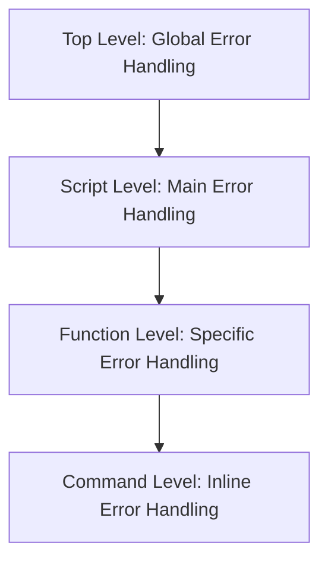

# 9. Error Handling and Script Robustness

Error handling is a critical aspect of writing production-quality PowerShell scripts. Without proper error handling, scripts can fail silently, produce incorrect results, or leave systems in inconsistent states. This chapter provides a comprehensive guide to error handling in PowerShell, covering both fundamental concepts and advanced techniques for creating robust, resilient scripts.

This chapter covers:
- Understanding PowerShell's error handling system (terminating vs. non-terminating errors)
- Using Try/Catch/Finally blocks for structured error handling
- Working with the $Error automatic variable
- Creating custom error records
- Using -ErrorAction and -ErrorVariable parameters effectively
- Implementing retry logic for transient failures
- Writing defensive code to prevent errors
- Logging and reporting errors effectively
- Testing error handling scenarios
- Common pitfalls and how to avoid them

By the end of this chapter, you'll be able to create scripts that handle errors gracefully, provide meaningful feedback, recover from failures, and maintain system integrity - essential skills for production-quality PowerShell code.

## 9.1 Understanding PowerShell's Error Handling System

PowerShell has a sophisticated error handling system that differs significantly from traditional shells. Understanding this system is fundamental to writing robust scripts.

### 9.1.1 Terminating vs. Non-Terminating Errors

PowerShell distinguishes between two types of errors, each requiring different handling approaches.

#### 9.1.1.1 Terminating Errors

- **Definition**: Errors that halt script execution immediately
- **Causes**: Syntax errors, critical runtime errors, explicitly thrown exceptions
- **Behavior**: Stop the current pipeline and command
- **Handling**: Must be caught with Try/Catch blocks
- **Examples**:
  ```powershell
  # Syntax error (terminating)
  Get-ChildItem | Where-Object { $_.Name = "file.txt" }  # Assignment in condition
  
  # Runtime error (terminating)
  $null.GetType()  # Method invocation on null
  
  # Explicitly thrown error
  throw "Something went wrong"
  ```

#### 9.1.1.2 Non-Terminating Errors

- **Definition**: Errors that allow script execution to continue
- **Causes**: Most cmdlet errors (file not found, access denied, etc.)
- **Behavior**: Write to error stream but continue pipeline
- **Handling**: Controlled with -ErrorAction parameter
- **Examples**:
  ```powershell
  # Non-terminating error (by default)
  Get-ChildItem "C:\NonExistentFolder"  # Writes error but continues
  
  # Convert to terminating with -ErrorAction Stop
  Get-ChildItem "C:\NonExistentFolder" -ErrorAction Stop
  ```

#### 9.1.1.3 Key Differences

| Characteristic | Terminating Error | Non-Terminating Error |
|----------------|-------------------|------------------------|
| Default behavior | Stops execution | Continues execution |
| Handling method | Try/Catch blocks | -ErrorAction parameter |
| Common sources | Syntax errors, $ErrorActionPreference = "Stop" | Most cmdlet errors |
| Stream | Error stream + halts pipeline | Error stream only |
| Recovery | Requires exception handling | Can often continue |

### 9.1.2 Error Preference Variables

PowerShell provides preference variables that control error handling behavior at different scopes.

#### 9.1.2.1 $ErrorActionPreference

Controls how PowerShell responds to non-terminating errors:

```powershell
# Default behavior (Continue)
$ErrorActionPreference = "Continue"
Get-ChildItem "C:\NonExistent"  # Shows error but continues

# Silently continue
$ErrorActionPreference = "SilentlyContinue"
Get-ChildItem "C:\NonExistent"  # No error output

# Treat non-terminating as terminating
$ErrorActionPreference = "Stop"
Get-ChildItem "C:\NonExistent"  # Throws terminating error

# Inquire (prompt for action)
$ErrorActionPreference = "Inquire"
Get-ChildItem "C:\NonExistent"  # Prompts for action
```

#### 9.1.2.2 $ErrorView

Controls how errors are displayed:

```powershell
# Normal view (default)
$ErrorView = "NormalView"
# Category: InvalidData: (:) [], ParentContainsErrorRecordException

# Category view
$ErrorView = "CategoryView"
# InvalidData: (:) [], ParentContainsErrorRecordException

# Detailed view (PowerShell 7+)
$ErrorView = "ConciseView"  # More detailed information
```

#### 9.1.2.3 Scope Considerations

Preference variables can be set at different scopes:

```powershell
# Local scope (current command)
Get-ChildItem "C:\NonExistent" -ErrorAction Stop

# Function scope
function Test-Error {
    $ErrorActionPreference = "Stop"
    Get-ChildItem "C:\NonExistent"
}

# Script scope
$script:ErrorActionPreference = "Stop"

# Global scope (affects all PowerShell sessions)
$global:ErrorActionPreference = "Stop"
```

### 9.1.3 Error Records and Information

PowerShell errors are rich objects containing detailed information.

#### 9.1.3.1 Error Record Structure

Error records contain these key properties:

| Property | Description |
|----------|-------------|
| `Exception` | The actual exception object |
| `TargetObject` | Object that caused the error |
| `FullyQualifiedErrorId` | Unique error identifier |
| `InvocationInfo` | Information about command invocation |
| `ScriptStackTrace` | Stack trace for script errors |
| `ErrorDetails` | Additional error details |

#### 9.1.3.2 Examining Error Records

```powershell
try {
    Get-ChildItem "C:\NonExistent" -ErrorAction Stop
} catch {
    # View complete error record
    $_ | Format-List * -Force
    
    # Key properties
    $_.Exception.Message
    $_.Exception.GetType().FullName
    $_.InvocationInfo.ScriptName
    $_.InvocationInfo.ScriptLineNumber
    $_.InvocationInfo.OffsetInLine
    $_.FullyQualifiedErrorId
}
```

#### 9.1.3.3 Common Error Types

PowerShell uses .NET exception types:

```powershell
try {
    $null.GetType()
} catch [System.Management.Automation.RuntimeException] {
    "Null-valued expression error"
} catch [System.IO.FileNotFoundException] {
    "File not found error"
} catch [System.UnauthorizedAccessException] {
    "Access denied error"
} catch {
    "Other error"
}
```

### 9.1.4 Error Handling Philosophy

Effective error handling requires understanding when and how to handle errors.

#### 9.1.4.1 When to Handle Errors

- **Handle errors** when:
  - You can recover from the error
  - You need to provide specific user feedback
  - You need to clean up resources
  - You need to transform the error

- **Don't handle errors** when:
  - The error should stop execution
  - You can't meaningfully recover
  - The error should be handled at a higher level

#### 9.1.4.2 Error Handling Levels

Error handling should occur at appropriate levels:



#### 9.1.4.3 Error Handling Goals

Effective error handling should:
- **Fail safely**: Leave systems in consistent state
- **Provide context**: Explain what went wrong
- **Enable recovery**: Allow for corrective action
- **Log appropriately**: Capture information for diagnosis
- **Fail gracefully**: When recovery isn't possible

## 9.2 Using Try/Catch/Finally Blocks

Try/Catch/Finally blocks provide structured exception handling in PowerShell.

### 9.2.1 Basic Try/Catch Structure

#### 9.2.1.1 Simple Error Handling

```powershell
try {
    Get-ChildItem "C:\NonExistent" -ErrorAction Stop
} catch {
    Write-Error "Failed to access directory: $_"
}
```

#### 9.2.1.2 Catching Specific Exceptions

```powershell
try {
    Get-ChildItem "C:\NonExistent" -ErrorAction Stop
} catch [System.IO.DirectoryNotFoundException] {
    Write-Error "Directory not found: $_"
} catch [System.UnauthorizedAccessException] {
    Write-Error "Access denied to directory: $_"
} catch {
    Write-Error "Unexpected error: $_"
}
```

#### 9.2.1.3 Accessing Error Information

```powershell
try {
    Get-ChildItem "C:\NonExistent" -ErrorAction Stop
} catch {
    Write-Error @"
Failed to access directory:
- Error: $($_.Exception.Message)
- File: $($_.InvocationInfo.ScriptName)
- Line: $($_.InvocationInfo.ScriptLineNumber)
- Command: $($_.InvocationInfo.Line)
"@
}
```

### 9.2.2 Advanced Try/Catch Patterns

#### 9.2.2.1 Multiple Catch Blocks

```powershell
try {
    # Code that might throw different exceptions
    if (Test-Path $path) {
        Get-Content $path -ErrorAction Stop
    } else {
        New-Item $path -ErrorAction Stop
    }
} catch [System.IO.FileNotFoundException] {
    Write-Error "File not found: $path"
} catch [System.IO.IOException] {
    Write-Error "IO error accessing file: $path"
} catch [System.Security.SecurityException] {
    Write-Error "Access denied to file: $path"
} catch {
    Write-Error "Unexpected error with file: $path - $_"
}
```

#### 9.2.2.2 Rethrowing Exceptions

```powershell
try {
    Get-ChildItem "C:\NonExistent" -ErrorAction Stop
} catch [System.IO.DirectoryNotFoundException] {
    # Log the error
    Write-EventLog -LogName Application -Source "MyScript" `
        -EntryType Error -EventId 1001 `
        -Message "Directory not found: $_"
    
    # Rethrow the same exception
    throw
    
    # Or throw a new exception with inner exception
    throw [System.IO.DirectoryNotFoundException]::new(
        "Custom message", $_.Exception
    )
}
```

#### 9.2.2.3 Error Category Handling

```powershell
try {
    Get-ChildItem "C:\NonExistent" -ErrorAction Stop
} catch {
    switch ($_.CategoryInfo.Category) {
        "ObjectNotFound" { 
            Write-Error "The specified object was not found: $_" 
        }
        "PermissionDenied" { 
            Write-Error "Access denied: $_" 
        }
        "InvalidArgument" { 
            Write-Error "Invalid parameter: $_" 
        }
        default { 
            Write-Error "Unexpected error: $_" 
        }
    }
}
```

### 9.2.3 Using Finally Blocks

Finally blocks execute regardless of whether an error occurred.

#### 9.2.3.1 Basic Finally Usage

```powershell
$resource = $null
try {
    $resource = Open-Resource
    # Work with resource
} catch {
    Write-Error "Error working with resource: $_"
} finally {
    # Always clean up resource
    if ($resource) {
        $resource.Close()
    }
}
```

#### 9.2.3.2 Common Finally Scenarios

```powershell
# File handling
$fileStream = $null
try {
    $fileStream = [System.IO.File]::Open("data.txt", "OpenOrCreate")
    # Process file
} catch {
    Write-Error "File error: $_"
} finally {
    if ($fileStream) {
        $fileStream.Close()
    }
}

# Database connection
$connection = $null
try {
    $connection = New-Object System.Data.SqlClient.SqlConnection("connection string")
    $connection.Open()
    # Execute queries
} catch {
    Write-Error "Database error: $_"
} finally {
    if ($connection -and $connection.State -ne "Closed") {
        $connection.Close()
    }
}
```

#### 9.2.3.3 Finally with Return Statements

```powershell
function Test-Finally {
    try {
        "In try block"
        return "Return value"
    } catch {
        "In catch block"
    } finally {
        "In finally block"
    }
}

# Output:
# In try block
# In finally block
# Return value
```

### 9.2.4 Best Practices for Try/Catch/Finally

#### 9.2.4.1 Keep Try Blocks Small

```powershell
# Bad: Large try block
try {
    # Many operations
    $a = Get-Data
    $b = Process-Data $a
    Save-Data $b
} catch {
    # Hard to know which operation failed
}

# Good: Small try blocks
try {
    $a = Get-Data
} catch {
    Write-Error "Failed to get data: $_"
    return
}

try {
    $b = Process-Data $a
} catch {
    Write-Error "Failed to process data: $_"
    return
}

try {
    Save-Data $b
} catch {
    Write-Error "Failed to save data: $_"
    return
}
```

#### 9.2.4.2 Specific Exception Handling

```powershell
# Bad: Generic catch-all
try {
    # Code
} catch {
    # Too broad
}

# Good: Specific exception types
try {
    # Code
} catch [System.IO.FileNotFoundException] {
    # Handle file not found
} catch [System.Net.WebException] {
    # Handle web errors
}
```

#### 9.2.4.3 Meaningful Error Messages

```powershell
# Bad: Uninformative error
catch {
    Write-Error "An error occurred"
}

# Good: Contextual error message
catch [System.IO.IOException] {
    Write-Error "Failed to access file '$filePath': $($_.Exception.Message)"
}
```

## 9.3 Working with the $Error Automatic Variable

The `$Error` automatic variable provides access to the error history in the current session.

### 9.3.1 Understanding $Error

#### 9.3.1.1 Basic $Error Properties

```powershell
# View recent errors
$Error[0]  # Most recent error
$Error[1]  # Second most recent error

# Error count
$Error.Count

# Clear error history
$Error.Clear()
```

#### 9.3.1.2 Error Record Details

```powershell
# Most recent error details
$Error[0] | Format-List * -Force

# Key properties
$Error[0].Exception.Message
$Error[0].InvocationInfo.ScriptName
$Error[0].InvocationInfo.ScriptLineNumber
$Error[0].InvocationInfo.OffsetInLine
$Error[0].FullyQualifiedErrorId
$Error[0].ScriptStackTrace
```

#### 9.3.1.3 Filtering Error History

```powershell
# Errors from specific command
$Error | Where-Object { 
    $_.InvocationInfo.MyCommand.Name -eq "Get-ChildItem" 
}

# Errors of specific type
$Error | Where-Object { 
    $_.Exception.GetType().Name -eq "DirectoryNotFoundException" 
}

# Recent errors (last 5 minutes)
$cutoff = (Get-Date).AddMinutes(-5)
$Error | Where-Object { 
    $_.InvocationInfo.BoundParameters.ContainsKey("Timestamp") -and 
    $_.InvocationInfo.BoundParameters["Timestamp"] -gt $cutoff 
}
```

### 9.3.2 Advanced $Error Techniques

#### 9.3.2.1 Error Logging with $Error

```powershell
# Log errors to file
$Error | ForEach-Object {
    $logEntry = @"
[$(Get-Date -Format "yyyy-MM-dd HH:mm:ss")]
Error: $($_.Exception.Message)
Script: $($_.InvocationInfo.ScriptName)
Line: $($_.InvocationInfo.ScriptLineNumber)
Command: $($_.InvocationInfo.Line)
Exception Type: $($_.Exception.GetType().FullName)
Stack Trace: $($_.ScriptStackTrace)
"@
    $logEntry | Out-File -FilePath "error.log" -Append
}

# Clear processed errors
$Error.Clear()
```

#### 9.3.2.2 Error Analysis and Reporting

```powershell
# Error summary report
$report = @"
Error Summary Report
Generated: $(Get-Date)
Total Errors: $($Error.Count)

Error Distribution by Type:
$($Error | Group-Object { $_.Exception.GetType().Name } | 
    Sort-Object Count -Descending | 
    ForEach-Object { "$($_.Name): $($_.Count)" })

Top Commands Causing Errors:
$($Error | Group-Object { $_.InvocationInfo.MyCommand.Name } | 
    Sort-Object Count -Descending | 
    Select-Object -First 5 | 
    ForEach-Object { "$($_.Name): $($_.Count)" })

Recent Errors:
$($Error | Select-Object -First 3 | ForEach-Object {
    "[$($_.InvocationInfo.ScriptLineNumber)}] $($_.Exception.Message)"
})
"@

$report | Out-File "error_summary.txt"
```

#### 9.3.2.3 Error Context Preservation

```powershell
# Preserve error context for later analysis
$script:errorContext = @()

function Invoke-WithErrorCapture {
    param(
        [ScriptBlock]$ScriptBlock
    )
    
    try {
        & $ScriptBlock
    } catch {
        $context = @{
            Error = $_
            Variables = Get-Variable -Scope 1 | 
                Where-Object { $_.Name -notin @("?", "^", "args", "Error", "MyInvocation") } |
                ForEach-Object { @{ Name = $_.Name; Value = $_.Value } }
            CallStack = Get-PSCallStack
        }
        $script:errorContext += $context
        throw
    }
}

# Usage
try {
    Invoke-WithErrorCapture {
        $data = "test"
        $null.GetType()
    }
} catch {
    # Error context is preserved
    $script:errorContext[0].Variables | 
        Where-Object { $_.Name -eq "data" } |
        Format-List *
}
```

### 9.3.3 Best Practices with $Error

#### 9.3.3.1 Regular Error Monitoring

```powershell
# Monitor errors during long-running operations
$startTime = Get-Date
while ((Get-Date) -lt $startTime.AddMinutes(30)) {
    try {
        # Long-running operation
        Perform-Operation
    } catch {
        # Handle immediate error
    }
    
    # Check for non-terminating errors
    if ($Error.Count -gt 0 -and 
        $Error[0].InvocationInfo.ScriptLineNumber -gt $lastErrorLine) {
        
        Write-Warning "Non-terminating error occurred: $($Error[0].Exception.Message)"
        $lastErrorLine = $Error[0].InvocationInfo.ScriptLineNumber
    }
    
    Start-Sleep -Seconds 5
}
```

#### 9.3.3.2 Error Thresholds

```powershell
# Implement error thresholds
$maxErrors = 5
$errorCount = 0

try {
    # Process multiple items
    Get-ChildItem | ForEach-Object {
        try {
            Process-Item $_
        } catch {
            $errorCount++
            if ($errorCount -ge $maxErrors) {
                throw "Maximum error threshold reached ($maxErrors)"
            }
            Write-Warning "Error processing $($_.Name): $_"
        }
    }
} finally {
    if ($errorCount -gt 0) {
        Write-Output "$errorCount items failed to process"
    }
}
```

#### 9.3.3.3 Error Context in Functions

```powershell
function Test-ErrorContext {
    [CmdletBinding()]
    param()
    
    process {
        try {
            # Code that might fail
            $data = Get-SomeData
            Process-Data $data
        } catch {
            # Include function context in error
            $context = @{
                FunctionName = $MyInvocation.MyCommand.Name
                Parameters = $PSBoundParameters
                DataState = $data
            }
            
            $newException = [System.Exception]::new(
                "Error in $($context.FunctionName): $($_.Exception.Message)",
                $_.Exception
            )
            
            $newErrorRecord = [System.Management.Automation.ErrorRecord]::new(
                $newException,
                "Custom.ErrorId",
                [System.Management.Automation.ErrorCategory]::NotSpecified,
                $context
            )
            
            $PSCmdlet.ThrowTerminatingError($newErrorRecord)
        }
    }
}
```

## 9.4 Using -ErrorAction and -ErrorVariable

The `-ErrorAction` and `-ErrorVariable` parameters provide fine-grained control over error handling.

### 9.4.1 Understanding -ErrorAction

#### 9.4.1.1 ErrorAction Values

| Value | Behavior |
|-------|----------|
| `Continue` | Default; write error and continue |
| `SilentlyContinue` | Suppress error messages |
| `Stop` | Convert to terminating error |
| `Inquire` | Prompt user for action |
| `Ignore` | Suppress error and continue (no entry in $Error) |
| `Suspend` | Debugger breaks (PowerShell workflows only) |

#### 9.4.1.2 Basic ErrorAction Usage

```powershell
# Default behavior (Continue)
Get-ChildItem "C:\NonExistent"

# Suppress error
Get-ChildItem "C:\NonExistent" -ErrorAction SilentlyContinue

# Convert to terminating error
try {
    Get-ChildItem "C:\NonExistent" -ErrorAction Stop
} catch {
    Write-Error "Directory access failed: $_"
}

# Prompt for action
Get-ChildItem "C:\NonExistent" -ErrorAction Inquire
```

#### 9.4.1.3 ErrorAction Scope

```powershell
# Command-level ErrorAction
Get-ChildItem "C:\NonExistent" -ErrorAction Stop

# Function-level ErrorAction
function Test-ErrorAction {
    [CmdletBinding()]
    param()
    
    process {
        # Uses default ErrorActionPreference
        Get-ChildItem "C:\NonExistent"
    }
}

# Call with specific ErrorAction
Test-ErrorAction -ErrorAction SilentlyContinue
```

### 9.4.2 Advanced ErrorAction Techniques

#### 9.4.2.1 Dynamic ErrorAction Selection

```powershell
# Select ErrorAction based on context
$errorAction = if ($DebugMode) { "Continue" } else { "Stop" }
Get-ChildItem "C:\NonExistent" -ErrorAction $errorAction

# Per-command ErrorAction selection
$commands = @(
    @{Command = "Get-ChildItem"; Path = "C:\Valid"; ErrorAction = "Continue"}
    @{Command = "Get-ChildItem"; Path = "C:\NonExistent"; ErrorAction = "Stop"}
)

foreach ($cmd in $commands) {
    try {
        & $cmd.Command $cmd.Path -ErrorAction $cmd.ErrorAction
    } catch {
        Write-Error "Failed to execute $($cmd.Command): $_"
    }
}
```

#### 9.4.2.2 ErrorAction in Pipelines

```powershell
# ErrorAction affects entire pipeline
Get-ChildItem -Path "C:\NonExistent", "C:\Valid" -ErrorAction Continue
# Shows error for non-existent, processes valid

Get-ChildItem -Path "C:\NonExistent", "C:\Valid" -ErrorAction Stop
# Stops at first error, doesn't process valid

# Isolate error impact with script blocks
"NonExistent", "Valid" | ForEach-Object {
    try {
        Get-ChildItem "C:\$_" -ErrorAction Stop
    } catch {
        Write-Warning "Error processing C:\$_: $_"
        $null
    }
}
```

#### 9.4.2.3 ErrorAction with Remote Commands

```powershell
# ErrorAction for remote commands
$computers = "Server1", "Server2", "Server3"

# Stop at first failure
Invoke-Command -ComputerName $computers -ScriptBlock {
    Get-Service -Name "NonExistentService"
} -ErrorAction Stop

# Continue despite failures
Invoke-Command -ComputerName $computers -ScriptBlock {
    Get-Service -Name "NonExistentService"
} -ErrorAction SilentlyContinue

# Custom error handling
$results = Invoke-Command -ComputerName $computers -ScriptBlock {
    try {
        Get-Service -Name "NonExistentService" -ErrorAction Stop
    } catch {
        [PSCustomObject]@{
            Error = $_.Exception.Message
            Computer = $env:COMPUTERNAME
        }
    }
}

# Process results
$results | Where-Object { $_ -is [System.Management.Automation.ErrorRecord] } |
    ForEach-Object {
        Write-Error "Remote error on $($_.InvocationInfo.MyCommand): $_"
    }
```

### 9.4.3 Using -ErrorVariable

#### 9.4.3.1 Basic ErrorVariable Usage

```powershell
# Capture errors in variable
Get-ChildItem "C:\NonExistent" -ErrorVariable myError

# Check if error occurred
if ($myError) {
    Write-Error "Directory access failed: $myError"
}

# Multiple commands with ErrorVariable
Get-ChildItem "C:\NonExistent1" -ErrorVariable err1
Get-ChildItem "C:\NonExistent2" -ErrorVariable +err1  # Append to same variable

$err1 | ForEach-Object {
    Write-Warning "Error: $_"
}
```

#### 9.4.3.2 Advanced ErrorVariable Patterns

```powershell
# ErrorVariable with Try/Catch
try {
    Get-ChildItem "C:\NonExistent" -ErrorVariable myError -ErrorAction Stop
} catch {
    # myError contains the error record
    Write-Error "Failed to access directory: $($myError.Exception.Message)"
}

# Error categorization with ErrorVariable
$ioErrors = $null
$securityErrors = $null

Get-ChildItem "C:\NonExistent" -ErrorVariable ioErrors `
    -ErrorAction SilentlyContinue
Get-ChildItem "C:\Restricted" -ErrorVariable securityErrors `
    -ErrorAction SilentlyContinue

if ($ioErrors) {
    Write-Warning "IO errors encountered: $($ioErrors.Count)"
}
if ($securityErrors) {
    Write-Warning "Security errors encountered: $($securityErrors.Count)"
}
```

#### 9.4.3.3 ErrorVariable in Complex Workflows

```powershell
# Workflow with multiple error streams
$allErrors = @{}
$stepErrors = @()

try {
    # Step 1: Configuration
    try {
        $config = Import-Config -ErrorVariable +stepErrors
    } catch {
        $allErrors["Config"] = $_
    }
    
    # Step 2: Data processing
    try {
        $processed = Process-Data $config -ErrorVariable +stepErrors
    } catch {
        $allErrors["Processing"] = $_
    }
    
    # Step 3: Output
    try {
        Export-Results $processed -ErrorVariable +stepErrors
    } catch {
        $allErrors["Export"] = $_
    }
    
    # Check for non-terminating errors
    if ($stepErrors) {
        $allErrors["NonTerminating"] = $stepErrors
    }
    
    # Final error check
    if ($allErrors.Count -gt 0) {
        throw [System.Exception]::new(
            "Workflow completed with $($allErrors.Count) errors"
        )
    }
} catch {
    $allErrors["Terminating"] = $_
    # Continue to cleanup
} finally {
    # Cleanup resources
    
    # Report all errors
    if ($allErrors.Count -gt 0) {
        $report = @"
Workflow completed with errors:
$($allErrors.GetEnumerator() | ForEach-Object {
    "- $($_.Key): $($_.Value.Exception.Message)"
})
"@
        Write-Error $report
        exit 1
    }
}
```

## 9.5 Creating Custom Error Records

Creating custom error records enhances error handling with specific context and structured information.

### 9.5.1 Understanding Error Records

#### 9.5.1.1 Error Record Components

Custom error records consist of:
- **Exception**: The actual exception object
- **Error ID**: Unique identifier for the error
- **Error Category**: Classification of the error type
- **Target Object**: The object that caused the error
- **Error Details**: Additional contextual information

#### 9.5.1.2 Error Categories

PowerShell defines standard error categories:

```powershell
[System.Management.Automation.ErrorCategory] | 
    Get-Member -Static -MemberType Property |
    Select-Object Name
```

Common categories include:
- `NotSpecified`
- `OpenError`
- `CloseError`
- `DeviceError`
- `DeadlockDetected`
- `InvalidArgument`
- `InvalidData`
- `InvalidOperation`
- `InvalidResult`
- `InvalidType`
- `MetadataError`
- `PermissionDenied`
- `ResourceBusy`
- `ResourceExists`
- `ResourceUnavailable`
- `ReadError`
- `WriteError`
- `FromStdErr`
- `ParserError`
- `SyntaxError`
- `Unspecified`

### 9.5.2 Creating Custom Errors

#### 9.5.2.1 Basic Custom Error

```powershell
# Create custom exception
$exception = [System.IO.FileNotFoundException]::new(
    "Custom file not found message",
    "C:\NonExistent.txt"
)

# Create error record
$errorId = "FileNotFound,MyModule"
$errorCategory = [System.Management.Automation.ErrorCategory]::ObjectNotFound
$errorTarget = "C:\NonExistent.txt"

$errorRecord = [System.Management.Automation.ErrorRecord]::new(
    $exception,
    $errorId,
    $errorCategory,
    $errorTarget
)

# Throw custom error
$PSCmdlet.ThrowTerminatingError($errorRecord)
```

#### 9.5.2.2 Function-Specific Custom Error

```powershell
function Get-ImportantData {
    [CmdletBinding()]
    param(
        [Parameter(Mandatory=$true)]
        [string]$Source
    )
    
    try {
        # Attempt to get data
        $data = Invoke-WebRequest -Uri $Source -ErrorAction Stop
        return $data
    } catch {
        # Create function-specific error
        $errorId = "DataRetrievalFailed,Get-ImportantData"
        $errorCategory = [System.Management.Automation.ErrorCategory]::ResourceUnavailable
        $errorTarget = $Source
        
        $exception = [System.Exception]::new(
            "Failed to retrieve data from '$Source': $($_.Exception.Message)",
            $_.Exception
        )
        
        $errorRecord = [System.Management.Automation.ErrorRecord]::new(
            $exception,
            $errorId,
            $errorCategory,
            $errorTarget
        )
        
        $PSCmdlet.ThrowTerminatingError($errorRecord)
    }
}
```

#### 9.5.2.3 Adding Error Details

```powershell
# Create error with additional details
$exception = [System.Exception]::new(
    "Configuration validation failed"
)

$errorId = "ConfigValidationFailed,MyModule"
$errorCategory = [System.Management.Automation.ErrorCategory]::InvalidData
$errorTarget = $configPath

$errorRecord = [System.Management.Automation.ErrorRecord]::new(
    $exception,
    $errorId,
    $errorCategory,
    $errorTarget
)

# Add error details
$errorRecord.ErrorDetails = [System.Management.Automation.ErrorDetails]::new(
    "Configuration validation failed"
)
$errorRecord.ErrorDetails.RecommendedAction = "Check configuration file syntax"
$errorRecord.ErrorDetails.ScriptStackTrace = Get-PSCallStack | Out-String

# Add custom properties
$errorRecord.Data["ConfigSection"] = "Database"
$errorRecord.Data["InvalidSetting"] = "ConnectionString"
$errorRecord.Data["ValidValues"] = @("SQLServer", "MySQL", "PostgreSQL")

# Throw error
$PSCmdlet.ThrowTerminatingError($errorRecord)
```

### 9.5.3 Best Practices for Custom Errors

#### 9.5.3.1 Consistent Error IDs

```powershell
# Good: Consistent error ID pattern
# Format: ErrorDescription,FunctionName
$errorId = "FileNotFound,Get-ImportantData"

# Bad: Inconsistent error IDs
$errorId1 = "FileNotFound"
$errorId2 = "Get-ImportantData.FileNotFound"
$errorId3 = "File not found error"
```

#### 9.5.3.2 Meaningful Error Messages

```powershell
# Bad: Uninformative message
$exception = [System.Exception]::new("Error occurred")

# Good: Contextual message with parameters
$exception = [System.Exception]::new(
    "Failed to connect to database server '$server' on port $port. " +
    "Please verify server is running and accessible."
)
```

#### 9.5.3.3 Including Actionable Information

```powershell
# Bad: No guidance for resolution
$exception = [System.Exception]::new("Invalid configuration")

# Good: Clear resolution steps
$errorDetails = [System.Management.Automation.ErrorDetails]::new(
    "Invalid configuration value"
)
$errorDetails.RecommendedAction = @"
The configuration value 'MaxConnections' must be between 1 and 100.
Current value: $currentValue

To fix:
1. Open configuration file: $configPath
2. Locate the 'MaxConnections' setting
3. Set value to a number between 1 and 100
4. Save and restart the service
"@
```

## 9.6 Implementing Retry Logic

Retry logic is essential for handling transient failures in network operations and external dependencies.

### 9.6.1 Basic Retry Patterns

#### 9.6.1.1 Simple Retry Loop

```powershell
$maxRetries = 3
$retryDelay = 2  # seconds

for ($retry = 1; $retry -le $maxRetries; $retry++) {
    try {
        # Operation that might fail transiently
        $result = Invoke-WebRequest -Uri "https://api.example.com/data" -ErrorAction Stop
        break  # Success, exit loop
    } catch {
        if ($retry -ge $maxRetries) {
            throw  # Final failure, rethrow
        }
        
        Write-Warning "Attempt $retry failed: $_"
        Start-Sleep -Seconds $retryDelay
    }
}

# Use result
$result
```

#### 9.6.1.2 Exponential Backoff

```powershell
function Invoke-WithRetry {
    param(
        [ScriptBlock]$ScriptBlock,
        [int]$MaxRetries = 3,
        [int]$BaseDelay = 1  # seconds
    )
    
    for ($retry = 1; $retry -le $MaxRetries; $retry++) {
        try {
            return & $ScriptBlock
        } catch {
            if ($retry -ge $MaxRetries) {
                throw
            }
            
            # Exponential backoff: 1s, 2s, 4s, etc.
            $delay = [Math]::Pow(2, $retry - 1) * $BaseDelay
            Write-Warning "Attempt $retry failed. Retrying in $delay seconds: $_"
            Start-Sleep -Seconds $delay
        }
    }
}

# Usage
$result = Invoke-WithRetry {
    Invoke-WebRequest -Uri "https://api.example.com/data" -ErrorAction Stop
}
```

### 9.6.2 Advanced Retry Techniques

#### 9.6.2.1 Conditional Retries

```powershell
function Invoke-WithConditionalRetry {
    param(
        [ScriptBlock]$ScriptBlock,
        [int]$MaxRetries = 3,
        [ScriptBlock]$RetryCondition,
        [int]$BaseDelay = 1
    )
    
    for ($retry = 1; $retry -le $maxRetries; $retry++) {
        try {
            $result = & $ScriptBlock
            return $result
        } catch {
            # Check if should retry based on error
            if ($retry -ge $maxRetries -or -not (& $RetryCondition $_)) {
                throw
            }
            
            $delay = [Math]::Pow(2, $retry - 1) * $BaseDelay
            Write-Warning "Transient error. Retrying in $delay seconds: $_"
            Start-Sleep -Seconds $delay
        }
    }
}

# Usage: Retry only for network-related errors
$result = Invoke-WithConditionalRetry -MaxRetries 5 {
    Invoke-WebRequest -Uri "https://api.example.com/data" -ErrorAction Stop
} -RetryCondition {
    param($error)
    $networkErrors = @(
        "System.Net.WebException",
        "System.Net.Sockets.SocketException",
        "System.TimeoutException"
    )
    $networkErrors -contains $error.Exception.GetType().FullName
}
```

#### 9.6.2.2 Retry Context and Logging

```powershell
function Invoke-WithRetryContext {
    param(
        [string]$OperationName,
        [ScriptBlock]$ScriptBlock,
        [int]$MaxRetries = 3
    )
    
    $context = @{
        Operation = $OperationName
        StartTime = Get-Date
        Attempts = 0
        Errors = @()
    }
    
    try {
        for ($retry = 1; $retry -le $MaxRetries; $retry++) {
            $context.Attempts++
            try {
                $result = & $ScriptBlock
                $context.EndTime = Get-Date
                $context.Success = $true
                return $result
            } catch {
                $context.Errors += @{
                    Attempt = $retry
                    Error = $_
                    Timestamp = Get-Date
                }
                
                if ($retry -ge $MaxRetries) { throw }
                
                $delay = [Math]::Pow(2, $retry - 1)
                Write-Verbose "[$OperationName] Attempt $retry failed. Retrying in $delay seconds."
                Start-Sleep -Seconds $delay
            }
        }
    } finally {
        # Log retry context
        $logEntry = @"
Operation: $($context.Operation)
Status: $($context.Success ? 'Success' : 'Failed')
Attempts: $($context.Attempts)
Duration: $([math]::Round((New-TimeSpan $context.StartTime $context.EndTime).TotalSeconds, 2)) seconds
"@
        
        if ($context.Errors) {
            $logEntry += "Errors:`n"
            $context.Errors | ForEach-Object {
                $logEntry += "  Attempt $($_.Attempt): $($_.Error.Exception.Message)`n"
            }
        }
        
        Write-Verbose $logEntry
    }
}

# Usage
$result = Invoke-WithRetryContext -OperationName "API-DataFetch" {
    Invoke-WebRequest -Uri "https://api.example.com/data" -ErrorAction Stop
}
```

### 9.6.3 Retry Best Practices

#### 9.6.3.1 Appropriate Retry Limits

```powershell
# Bad: Unlimited retries
while ($true) {
    try {
        # Operation
        break
    } catch {
        Start-Sleep -Seconds 1
    }
}

# Good: Configurable retry limits with defaults
function Invoke-ApiCall {
    param(
        [int]$MaxRetries = 5,
        [int]$MaxTotalTime = 30  # seconds
    )
    
    $startTime = Get-Date
    for ($retry = 1; $retry -le $MaxRetries; $retry++) {
        if ((Get-Date) -gt $startTime.AddSeconds($MaxTotalTime)) {
            throw "Maximum retry time exceeded"
        }
        
        try {
            # API call
            return Invoke-WebRequest -Uri $Uri -ErrorAction Stop
        } catch {
            if ($retry -ge $MaxRetries) { throw }
            # Exponential backoff
            Start-Sleep -Seconds ([Math]::Pow(2, $retry - 1))
        }
    }
}
```

#### 9.6.3.2 Identifying Transient Errors

```powershell
function Is-TransientError {
    param($ErrorRecord)
    
    $transientErrors = @(
        "System.Net.WebException",
        "System.Net.Sockets.SocketException",
        "System.TimeoutException",
        "503",
        "504",
        "The operation was canceled"
    )
    
    # Check exception type
    $exceptionType = $ErrorRecord.Exception.GetType().FullName
    if ($transientErrors -contains $exceptionType) { return $true }
    
    # Check HTTP status codes
    if ($ErrorRecord.Exception -is [Microsoft.PowerShell.Commands.HttpResponseException]) {
        $statusCode = $ErrorRecord.Exception.Response.StatusCode.value__
        if ($transientErrors -contains $statusCode) { return $true }
    }
    
    # Check error message patterns
    $transientPatterns = @(
        "timeout",
        "connection refused",
        "service unavailable",
        "retry"
    )
    
    $errorMessage = $ErrorRecord.Exception.Message.ToLower()
    foreach ($pattern in $transientPatterns) {
        if ($errorMessage -match $pattern) { return $true }
    }
    
    return $false
}

# Usage in retry logic
if (Is-TransientError $_) {
    # Retry
} else {
    # Don't retry, rethrow
    throw
}
```

#### 9.6.3.3 Retry Budgets

```powershell
# Implement retry budgets
function Invoke-WithRetryBudget {
    param(
        [ScriptBlock]$ScriptBlock,
        [timespan]$MaxTotalTime = "00:00:30",  # 30 seconds
        [int]$MaxRetries = 5
    )
    
    $startTime = Get-Date
    $attempts = 0
    
    while ($attempts -lt $MaxRetries) {
        $elapsed = (Get-Date) - $startTime
        if ($elapsed -ge $MaxTotalTime) {
            throw "Retry budget exceeded: $($elapsed.TotalSeconds) seconds"
        }
        
        try {
            return & $ScriptBlock
        } catch {
            $attempts++
            
            # Calculate remaining time for backoff
            $remainingTime = $MaxTotalTime - $elapsed
            $maxBackoff = [Math]::Min(
                [Math]::Pow(2, $attempts - 1),
                $remainingTime.TotalSeconds / ($MaxRetries - $attempts)
            )
            
            if ($maxBackoff -le 0) {
                throw "Insufficient time for retry"
            }
            
            Write-Verbose "Attempt $attempts failed. Retrying in $maxBackoff seconds."
            Start-Sleep -Seconds $maxBackoff
        }
    }
    
    throw "Maximum retry attempts exceeded"
}
```

## 9.7 Writing Defensive Code

Defensive coding prevents errors before they occur through validation, checks, and safe patterns.

### 9.7.1 Input Validation

#### 9.7.1.1 Parameter Validation Attributes

```powershell
function Get-ValidatedData {
    [CmdletBinding()]
    param(
        [Parameter(Mandatory=$true)]
        [ValidateNotNullOrEmpty()]
        [string]$Name,
        
        [ValidateRange(1, 100)]
        [int]$Count = 10,
        
        [ValidateSet("Low", "Medium", "High")]
        [string]$Priority = "Medium",
        
        [ValidateScript({ Test-Path $_ -PathType Container })]
        [string]$Path = $PWD
    )
    
    # Function body
    Write-Output "Name: $Name, Count: $Count, Priority: $Priority, Path: $Path"
}
```

#### 9.7.1.2 Manual Input Validation

```powershell
function Process-Data {
    param(
        [Parameter(Mandatory=$true)]
        $InputData,
        
        [string]$OutputPath
    )
    
    # Validate input data
    if (-not $InputData) {
        throw [System.ArgumentNullException]::new(
            "InputData", "Input data cannot be null"
        )
    }
    
    if ($InputData -is [array] -and $InputData.Count -eq 0) {
        throw [System.ArgumentException]::new(
            "Input data array cannot be empty"
        )
    }
    
    # Validate output path
    if ($OutputPath) {
        $directory = [System.IO.Path]::GetDirectoryName($OutputPath)
        if (-not (Test-Path $directory -PathType Container)) {
            throw [System.IO.DirectoryNotFoundException]::new(
                "Output directory not found: $directory"
            )
        }
        
        if (Test-Path $OutputPath -PathType Leaf -and -not $Force) {
            throw [System.IO.IOException]::new(
                "Output file already exists: $OutputPath"
            )
        }
    }
    
    # Process data
    # ...
}
```

#### 9.7.1.3 Data Structure Validation

```powershell
function Validate-Configuration {
    param(
        [Parameter(Mandatory=$true)]
        [hashtable]$Config
    )
    
    $requiredKeys = @("Database", "Logging", "API")
    $missingKeys = $requiredKeys | Where-Object { -not $Config.ContainsKey($_) }
    
    if ($missingKeys) {
        throw [System.ArgumentException]::new(
            "Missing required configuration sections: $($missingKeys -join ', ')"
        )
    }
    
    # Validate database section
    $db = $Config.Database
    $requiredDbKeys = @("Server", "Port", "DatabaseName")
    $missingDbKeys = $requiredDbKeys | Where-Object { -not $db.ContainsKey($_) }
    
    if ($missingDbKeys) {
        throw [System.ArgumentException]::new(
            "Missing required database settings: $($missingDbKeys -join ', ')"
        )
    }
    
    if (-not [int]::TryParse($db.Port, [ref]$null)) {
        throw [System.ArgumentException]::new(
            "Database port must be a valid integer: $($db.Port)"
        )
    }
    
    # Additional validation...
}
```

### 9.7.2 Null Safety

#### 9.7.2.1 Null Checks

```powershell
# Bad: No null checking
$process = Get-Process -Id $pid
$process.Name.ToUpper()

# Good: Null checking
$process = Get-Process -Id $pid -ErrorAction SilentlyContinue
if (-not $process) {
    Write-Error "Process not found"
    return
}
$process.Name.ToUpper()

# Better: Null-conditional operators (PowerShell 7+)
$process = Get-Process -Id $pid -ErrorAction SilentlyContinue
$process?.Name?.ToUpper()
```

#### 9.7.2.2 Safe Property Access

```powershell
# Bad: Direct property access
$service = Get-Service -Name "NonExistentService" -ErrorAction SilentlyContinue
$service.Status

# Good: Null checking
$service = Get-Service -Name "NonExistentService" -ErrorAction SilentlyContinue
if ($service) {
    $status = $service.Status
} else {
    $status = $null
}

# Better: Safe property access function
function Get-PropertyValue {
    param(
        $Object,
        [string]$PropertyName,
        $DefaultValue = $null
    )
    
    if (-not $Object) { return $DefaultValue }
    
    try {
        $value = $Object.$PropertyName
        return $value
    } catch {
        return $DefaultValue
    }
}

# Usage
$status = Get-PropertyValue $service "Status"
```

#### 9.7.2.3 Null Coalescing

```powershell
# Null coalescing (PowerShell 7+)
$process = Get-Process -Id $pid -ErrorAction SilentlyContinue
$processName = $process?.Name ?? "Unknown Process"

# Equivalent in PowerShell 5.1
$processName = if ($process -and $process.Name) { $process.Name } else { "Unknown Process" }

# Custom null coalescing function for older PowerShell
function Invoke-NullCoalescing {
    param(
        [ScriptBlock]$ScriptBlock,
        $DefaultValue
    )
    
    try {
        $result = & $ScriptBlock
        if ($null -ne $result) { return $result }
    } catch {
        # Ignore exceptions
    }
    
    return $DefaultValue
}

# Usage
$processName = Invoke-NullCoalescing { $process.Name } "Unknown Process"
```

### 9.7.3 Resource Management

#### 9.7.3.1 Safe Resource Handling

```powershell
# Bad: Resource not properly released
$fileStream = [System.IO.File]::Open("data.txt", "OpenOrCreate")
# Process file
# Resource leak if exception occurs

# Good: Using try/finally
$fileStream = $null
try {
    $fileStream = [System.IO.File]::Open("data.txt", "OpenOrCreate")
    # Process file
} finally {
    if ($fileStream) {
        $fileStream.Close()
    }
}

# Better: Using statement (PowerShell 7+)
using ($fileStream = [System.IO.File]::Open("data.txt", "OpenOrCreate")) {
    # Process file
    # Resource automatically disposed
}
```

#### 9.7.3.2 Safe COM Object Handling

```powershell
# Bad: COM objects not properly released
$excel = New-Object -ComObject Excel.Application
$excel.Visible = $true
$workbook = $excel.Workbooks.Add()

# Good: Proper COM cleanup
$excel = $null
$workbook = $null
try {
    $excel = New-Object -ComObject Excel.Application
    $excel.Visible = $true
    $workbook = $excel.Workbooks.Add()
    
    # Work with Excel
} finally {
    if ($workbook) { $workbook.Close() }
    if ($excel) {
        $excel.Quit()
        [System.Runtime.InteropServices.Marshal]::ReleaseComObject($excel) | Out-Null
    }
    [System.GC]::Collect()
    [System.GC]::WaitForPendingFinalizers()
}
```

#### 9.7.3.3 Safe Temporary Files

```powershell
function Use-TemporaryFile {
    param(
        [ScriptBlock]$ScriptBlock
    )
    
    $tempFile = $null
    try {
        $tempFile = [System.IO.Path]::GetTempFileName()
        & $ScriptBlock $tempFile
    } finally {
        if ($tempFile -and (Test-Path $tempFile)) {
            Remove-Item $tempFile -Force -ErrorAction SilentlyContinue
        }
    }
}

# Usage
Use-TemporaryFile {
    param($file)
    Set-Content -Path $file -Value "Temporary data"
    Get-Content -Path $file
}
```

## 9.8 Logging and Reporting Errors

Effective error logging and reporting are crucial for diagnosing issues in production environments.

### 9.8.1 Structured Error Logging

#### 9.8.1.1 Basic Error Logging

```powershell
function Write-ErrorLog {
    param(
        [Parameter(Mandatory=$true)]
        $ErrorRecord,
        
        [ValidateSet("Debug", "Info", "Warning", "Error", "Critical")]
        [string]$Level = "Error",
        
        [string]$LogPath = "C:\Logs\script.log"
    )
    
    $timestamp = Get-Date -Format "yyyy-MM-dd HH:mm:ss"
    $message = $ErrorRecord.Exception.Message
    
    $logEntry = "[$timestamp] [$Level] $message"
    
    if ($ErrorRecord.InvocationInfo) {
        $logEntry += " (Script: $($ErrorRecord.InvocationInfo.ScriptName), Line: $($ErrorRecord.InvocationInfo.ScriptLineNumber))"
    }
    
    $logEntry | Out-File -FilePath $LogPath -Append
}

# Usage in catch block
try {
    # Code
} catch {
    Write-ErrorLog $_ -Level "Critical"
    throw
}
```

#### 9.8.1.2 Structured JSON Logging

```powershell
function Write-StructuredLog {
    param(
        [Parameter(Mandatory=$true)]
        $ErrorRecord,
        
        [ValidateSet("Debug", "Info", "Warning", "Error", "Critical")]
        [string]$Level = "Error",
        
        [string]$LogPath = "C:\Logs\script.json"
    )
    
    $logEntry = [PSCustomObject]@{
        Timestamp = (Get-Date).ToString("o")
        Level = $Level
        Message = $ErrorRecord.Exception.Message
        ExceptionType = $ErrorRecord.Exception.GetType().FullName
        ScriptName = $ErrorRecord.InvocationInfo.ScriptName
        ScriptLineNumber = $ErrorRecord.InvocationInfo.ScriptLineNumber
        Command = $ErrorRecord.InvocationInfo.Line
        FullyQualifiedErrorId = $ErrorRecord.FullyQualifiedErrorId
    }
    
    # Add error details if present
    if ($ErrorRecord.ErrorDetails) {
        $logEntry | Add-Member -MemberType NoteProperty -Name "ErrorDetails" -Value @{
            Message = $ErrorRecord.ErrorDetails.Message
            RecommendedAction = $ErrorRecord.ErrorDetails.RecommendedAction
        }
    }
    
    # Add custom data if present
    if ($ErrorRecord.Data.Count -gt 0) {
        $customData = @{}
        $ErrorRecord.Data.GetEnumerator() | ForEach-Object {
            $customData[$_.Key] = $_.Value
        }
        $logEntry | Add-Member -MemberType NoteProperty -Name "Data" -Value $customData
    }
    
    $logEntry | ConvertTo-Json | Out-File -FilePath $LogPath -Append
}

# Usage
try {
    # Code
} catch {
    Write-StructuredLog $_ -Level "Critical"
    throw
}
```

#### 9.8.1.3 Centralized Logging Service

```powershell
class LoggingService {
    hidden [string]$serviceUrl
    
    LoggingService([string]$serviceUrl) {
        $this.serviceUrl = $serviceUrl
    }
    
    [void]LogError([System.Management.Automation.ErrorRecord]$error, [string]$source) {
        $logEntry = @{
            Timestamp = (Get-Date).ToString("o")
            Level = "Error"
            Source = $source
            Message = $error.Exception.Message
            ExceptionType = $error.Exception.GetType().FullName
            ScriptName = $error.InvocationInfo.ScriptName
            ScriptLineNumber = $error.InvocationInfo.ScriptLineNumber
            Command = $error.InvocationInfo.Line
            FullyQualifiedErrorId = $error.FullyQualifiedErrorId
        }
        
        try {
            $response = Invoke-RestMethod -Uri $this.serviceUrl `
                -Method Post `
                -Body ($logEntry | ConvertTo-Json) `
                -ContentType "application/json" `
                -ErrorAction Stop
        } catch {
            # Fallback to file logging if service is unavailable
            $this.LogToLocal($logEntry)
        }
    }
    
    [void]LogToLocal([hashtable]$logEntry) {
        $logPath = "C:\Logs\failover.log"
        "$($logEntry.Timestamp) [$($logEntry.Level)] $($logEntry.Message)" | 
            Out-File -FilePath $logPath -Append
    }
}

# Usage
$logger = [LoggingService]::new("https://logging.example.com/api/logs")

try {
    # Code
} catch {
    $logger.LogError($_, "MyScript")
    throw
}
```

### 9.8.2 Error Reporting to Users

#### 9.8.2.1 User-Friendly Error Messages

```powershell
function Show-UserError {
    param(
        [Parameter(Mandatory=$true)]
        $ErrorRecord
    )
    
    $message = switch ($ErrorRecord.FullyQualifiedErrorId) {
        "FileNotFound,MyApp" {
            "The specified file was not found. Please verify the file path and try again."
        }
        "ConnectionFailed,MyApp" {
            "Failed to connect to the server. Please check your network connection and try again."
        }
        default {
            "An unexpected error occurred. Please contact support with the following details:"
        }
    }
    
    $details = @"
Error: $($ErrorRecord.Exception.Message)
Code: $($ErrorRecord.FullyQualifiedErrorId)
Time: $(Get-Date)
"@
    
    if ($ErrorRecord.ErrorDetails -and $ErrorRecord.ErrorDetails.RecommendedAction) {
        $details += "Suggestion: $($ErrorRecord.ErrorDetails.RecommendedAction)`n"
    }
    
    # Display message based on host
    if ($Host.Name -eq "ConsoleHost") {
        Write-Host "`nERROR: $message`n" -ForegroundColor Red
        Write-Host $details
    } else {
        $window = New-Object System.Windows.Window
        $window.Title = "Application Error"
        $window.Width = 400
        $window.Height = 300
        
        $textBlock = New-Object System.Windows.Controls.TextBlock
        $textBlock.Text = "ERROR: $message`n`n$details"
        $textBlock.TextWrapping = "Wrap"
        $textBlock.Margin = 10
        
        $window.Content = $textBlock
        $window.ShowDialog() | Out-Null
    }
}
```

#### 9.8.2.2 Error Reporting with Context

```powershell
function Show-ErrorWithContext {
    param(
        [Parameter(Mandatory=$true)]
        $ErrorRecord,
        
        [hashtable]$Context = @{}
    )
    
    $contextInfo = $Context.GetEnumerator() | ForEach-Object {
        "$($_.Key): $($_.Value)"
    } -join "`n"
    
    $message = @"
An error occurred while performing the operation.

Error details:
- Message: $($ErrorRecord.Exception.Message)
- Type: $($ErrorRecord.Exception.GetType().FullName)
- Script: $($ErrorRecord.InvocationInfo.ScriptName)
- Line: $($ErrorRecord.InvocationInfo.ScriptLineNumber)

Operation context:
$contextInfo

Please contact support with this information.
"@
    
    # Log to file
    $logPath = "C:\Logs\user_errors.log"
    $message | Out-File -FilePath $logPath -Append
    
    # Display to user
    if ($Host.Name -eq "ConsoleHost") {
        Write-Host $message -ForegroundColor Red
    } else {
        # GUI display code
    }
}
```

#### 9.8.2.3 Error Telemetry

```powershell
function Send-ErrorTelemetry {
    param(
        [Parameter(Mandatory=$true)]
        $ErrorRecord,
        
        [string]$ApplicationName,
        [string]$Version
    )
    
    $telemetry = @{
        Timestamp = (Get-Date).ToString("o")
        Application = $ApplicationName
        Version = $Version
        ErrorId = $ErrorRecord.FullyQualifiedErrorId
        ErrorMessage = $ErrorRecord.Exception.Message
        ExceptionType = $ErrorRecord.Exception.GetType().FullName
        ScriptName = $ErrorRecord.InvocationInfo.ScriptName
        ScriptLineNumber = $ErrorRecord.InvocationInfo.ScriptLineNumber
        Command = $ErrorRecord.InvocationInfo.Line
        HostName = $env:COMPUTERNAME
        UserName = $env:USERNAME
        OS = (Get-CimInstance Win32_OperatingSystem).Caption
    }
    
    # Add custom data if present
    if ($ErrorRecord.Data.Count -gt 0) {
        $telemetry["CustomData"] = @{}
        $ErrorRecord.Data.GetEnumerator() | ForEach-Object {
            $telemetry["CustomData"][$_.Key] = $_.Value
        }
    }
    
    # Send to telemetry service
    try {
        $json = $telemetry | ConvertTo-Json -Compress
        $headers = @{ "X-Api-Key" = "TELEMETRY_API_KEY" }
        Invoke-RestMethod `
            -Uri "https://telemetry.example.com/api/errors" `
            -Method Post `
            -Body $json `
            -Headers $headers `
            -ContentType "application/json" `
            -ErrorAction Stop
    } catch {
        # Fallback: log locally
        $logPath = "C:\Logs\telemetry_errors.log"
        $json | Out-File -FilePath $logPath -Append
    }
}
```

## 9.9 Testing Error Handling Scenarios

Testing error handling ensures your scripts behave correctly when things go wrong.

### 9.9.1 Creating Test Errors

#### 9.9.1.1 Simulating Specific Errors

```powershell
# Simulate file not found
function Test-FileNotFound {
    $filePath = "C:\NonExistentFile.txt"
    try {
        Get-Content $filePath -ErrorAction Stop
        return $false  # Should have thrown
    } catch [System.IO.FileNotFoundException] {
        return $true  # Correct exception
    } catch {
        return $false  # Wrong exception
    }
}

# Simulate network error
function Test-NetworkError {
    try {
        Invoke-WebRequest "http://non-existent.example.com" -ErrorAction Stop
        return $false
    } catch [System.Net.WebException] {
        return $true
    } catch {
        return $false
    }
}
```

#### 9.9.1.2 Mocking Error Conditions

```powershell
# Using Pester to mock errors
Describe "Error Handling Tests" {
    Context "File Operations" {
        It "Handles file not found gracefully" {
            # Mock Get-Content to throw specific exception
            Mock Get-Content {
                throw [System.IO.FileNotFoundException]::new(
                    "File not found", "C:\NonExistent.txt"
                )
            }
            
            # Call function that should handle the error
            { My-FileFunction "C:\NonExistent.txt" } | Should -Not -Throw
        }
        
        It "Provides meaningful error message" {
            Mock Get-Content {
                throw [System.IO.FileNotFoundException]::new(
                    "File not found", "C:\NonExistent.txt"
                )
            }
            
            $result = My-FileFunction "C:\NonExistent.txt" -ErrorVariable err
            $err.Exception.Message | Should -Match "custom message"
        }
    }
}
```

#### 9.9.1.3 Generating Custom Error Records

```powershell
function New-TestErrorRecord {
    param(
        [string]$ExceptionType = "System.Exception",
        [string]$Message = "Test error",
        [string]$ErrorId = "TestError",
        [System.Management.Automation.ErrorCategory]$Category = 
            [System.Management.Automation.ErrorCategory]::NotSpecified,
        $TargetObject = $null
    )
    
    # Create exception
    $exceptionType = [Type]$ExceptionType
    $exception = $exceptionType::new($Message)
    
    # Create error record
    $errorRecord = [System.Management.Automation.ErrorRecord]::new(
        $exception,
        $ErrorId,
        $Category,
        $TargetObject
    )
    
    return $errorRecord
}

# Usage
$errorRecord = New-TestErrorRecord `
    -ExceptionType "System.IO.FileNotFoundException" `
    -Message "File not found during test" `
    -ErrorId "FileNotFound,Test" `
    -Category ([System.Management.Automation.ErrorCategory]::ObjectNotFound) `
    -TargetObject "C:\TestFile.txt"

# Test error handling
try {
    $PSCmdlet.ThrowTerminatingError($errorRecord)
} catch {
    # Verify error handling works
}
```

### 9.9.2 Testing Error Recovery

#### 9.9.2.1 Verifying Error Recovery

```powershell
# Test function that should recover from errors
function Test-Recovery {
    param(
        [int]$ErrorCount = 1
    )
    
    $errorOccurred = $false
    $recoverySuccessful = $false
    
    try {
        # Simulate errors
        1..$ErrorCount | ForEach-Object {
            if ($_ -le $ErrorCount) {
                throw [System.Exception]::new("Simulated error $_")
            }
            "Operation succeeded"
        }
    } catch {
        $errorOccurred = $true
        # Recovery logic
        "Performing recovery..."
        $recoverySuccessful = $true
    }
    
    return @{
        ErrorOccurred = $errorOccurred
        RecoverySuccessful = $recoverySuccessful
    }
}

# Test cases
$test1 = Test-Recovery -ErrorCount 0
$test1.ErrorOccurred        # False
$test1.RecoverySuccessful   # False

$test2 = Test-Recovery -ErrorCount 1
$test2.ErrorOccurred        # True
$test2.RecoverySuccessful   # True
```

#### 9.9.2.2 Testing Retry Logic

```powershell
function Test-RetryLogic {
    param(
        [int]$MaxRetries = 3,
        [int]$FailureCount = 2
    )
    
    $attempts = 0
    $success = $false
    
    try {
        for ($i = 1; $i -le $MaxRetries; $i++) {
            $attempts++
            if ($i -le $FailureCount) {
                throw [System.Exception]::new("Simulated failure $i")
            }
            $success = $true
            break
        }
    } catch {
        if ($attempts -ge $MaxRetries) {
            throw
        }
    }
    
    return @{
        Attempts = $attempts
        Success = $success
        MaxRetries = $MaxRetries
        FailureCount = $FailureCount
    }
}

# Test cases
$test1 = Test-RetryLogic -MaxRetries 3 -FailureCount 2
$test1.Attempts     # 3
$test1.Success      # True

$test2 = Test-RetryLogic -MaxRetries 2 -FailureCount 2
{ $test2 = Test-RetryLogic -MaxRetries 2 -FailureCount 2 } | Should -Throw
```

#### 9.9.2.3 Testing Resource Cleanup

```powershell
function Test-ResourceCleanup {
    param(
        [switch]$ThrowError
    )
    
    $resourceCreated = $false
    $cleanupExecuted = $false
    
    $resource = $null
    try {
        $resource = [pscustomobject]@{ Name = "TestResource" }
        $resourceCreated = $true
        
        if ($ThrowError) {
            throw [System.Exception]::new("Simulated error")
        }
        
        "Resource used successfully"
    } finally {
        if ($resource) {
            # Simulate cleanup
            $cleanupExecuted = $true
        }
    }
    
    return @{
        ResourceCreated = $resourceCreated
        CleanupExecuted = $cleanupExecuted
    }
}

# Test cases
$test1 = Test-ResourceCleanup
$test1.ResourceCreated   # True
$test1.CleanupExecuted   # True

$test2 = Test-ResourceCleanup -ThrowError
$test2.ResourceCreated   # True
$test2.CleanupExecuted   # True
```

### 9.9.3 Error Handling Test Framework

#### 9.9.3.1 Custom Error Testing Functions

```powershell
function Test-Error {
    param(
        [ScriptBlock]$ScriptBlock,
        [Type]$ExceptionType,
        [string]$ErrorId,
        [System.Management.Automation.ErrorCategory]$Category,
        [string]$MessagePattern
    )
    
    try {
        & $ScriptBlock
        return $false  # No exception thrown
    } catch {
        # Verify exception type
        if ($ExceptionType -and $_.Exception.GetType() -ne $ExceptionType) {
            return $false
        }
        
        # Verify error ID
        if ($ErrorId -and $_.FullyQualifiedErrorId -notmatch $ErrorId) {
            return $false
        }
        
        # Verify category
        if ($Category -and $_.CategoryInfo.Category -ne $Category) {
            return $false
        }
        
        # Verify message pattern
        if ($MessagePattern -and $_.Exception.Message -notmatch $MessagePattern) {
            return $false
        }
        
        return $true  # All checks passed
    }
}

# Usage
$test1 = Test-Error -ExceptionType [System.IO.FileNotFoundException] {
    Get-Content "C:\NonExistent.txt" -ErrorAction Stop
}

$test2 = Test-Error -ErrorId "PathNotFound,Get-Content" {
    Get-Content "C:\NonExistent.txt" -ErrorAction Stop
}

$test3 = Test-Error -MessagePattern "cannot be found" {
    Get-Content "C:\NonExistent.txt" -ErrorAction Stop
}
```

#### 9.9.3.2 Comprehensive Error Testing

```powershell
function Invoke-ErrorTest {
    param(
        [string]$TestName,
        [ScriptBlock]$Setup,
        [ScriptBlock]$Action,
        [hashtable]$Expectations
    )
    
    $result = @{
        Name = $TestName
        Passed = $false
        Error = $null
        Details = @{}
    }
    
    try {
        # Run setup
        if ($Setup) { & $Setup }
        
        # Run action (expecting error)
        try {
            & $Action
            $result.Error = "Expected error but none occurred"
        } catch {
            # Verify expectations
            $result.Details["ActualError"] = $_
            
            # Check exception type
            if ($Expectations.ExceptionType) {
                $matches = $_.Exception.GetType() -eq $Expectations.ExceptionType
                $result.Details["ExceptionType"] = $matches
                if (-not $matches) {
                    $result.Error = "Expected exception type $($Expectations.ExceptionType), got $($_.Exception.GetType())"
                }
            }
            
            # Check error ID
            if ($Expectations.ErrorId) {
                $matches = $_.FullyQualifiedErrorId -match $Expectations.ErrorId
                $result.Details["ErrorId"] = $matches
                if (-not $matches) {
                    $result.Error = "Expected error ID $($Expectations.ErrorId), got $($_.FullyQualifiedErrorId)"
                }
            }
            
            # Check category
            if ($Expectations.Category) {
                $matches = $_.CategoryInfo.Category -eq $Expectations.Category
                $result.Details["Category"] = $matches
                if (-not $matches) {
                    $result.Error = "Expected category $($Expectations.Category), got $($_.CategoryInfo.Category)"
                }
            }
            
            # Check message
            if ($Expectations.MessagePattern) {
                $matches = $_.Exception.Message -match $Expectations.MessagePattern
                $result.Details["Message"] = $matches
                if (-not $matches) {
                    $result.Error = "Expected message pattern '$($Expectations.MessagePattern)', got '$($_.Exception.Message)'"
                }
            }
            
            # If no specific error, success
            if (-not $result.Error) {
                $result.Passed = $true
            }
        }
    } catch {
        $result.Error = "Test setup/action failed: $_"
    }
    
    return $result
}

# Usage
$tests = @(
    @{
        Name = "File not found"
        Action = { Get-Content "C:\NonExistent.txt" -ErrorAction Stop }
        Expectations = @{
            ExceptionType = [System.IO.FileNotFoundException]
            ErrorId = "PathNotFound,Get-Content"
            Category = [System.Management.Automation.ErrorCategory]::ObjectNotFound
            MessagePattern = "cannot be found"
        }
    },
    @{
        Name = "Access denied"
        Action = { Get-Content "C:\Restricted.txt" -ErrorAction Stop }
        Expectations = @{
            ExceptionType = [System.UnauthorizedAccessException]
            ErrorId = "PermissionDenied,Get-Content"
            Category = [System.Management.Automation.ErrorCategory]::PermissionDenied
            MessagePattern = "access is denied"
        }
    }
)

$results = $tests | ForEach-Object {
    Invoke-ErrorTest @_
}

# Report results
$results | Format-Table Name, Passed, Error -AutoSize
```

## 9.10 Common Pitfalls and Solutions

Even experienced PowerShell developers encounter common error handling pitfalls. Understanding these issues helps write more robust code.

### 9.10.1 Common Error Handling Mistakes

#### 9.10.1.1 Catch-All Without Rethrow

```powershell
# Bad: Swallowing all errors
try {
    # Code
} catch {
    Write-Host "An error occurred"  # No details, no rethrow
}

# Bad: Catch-all with generic message
try {
    # Code
} catch {
    Write-Error "Operation failed"  # No context
}
```

**Solution**: Always include error details and consider rethrowing:

```powershell
try {
    # Code
} catch {
    Write-Error "Operation failed: $_"
    throw  # Rethrow if appropriate
}
```

#### 9.10.1.2 Ignoring Non-Terminating Errors

```powershell
# Bad: Not handling non-terminating errors
Get-ChildItem "C:\NonExistent", "C:\Valid"  # Error for non-existent, continues

# Bad: Using -ErrorAction without checking
Get-ChildItem "C:\NonExistent" -ErrorAction SilentlyContinue
# No indication of failure
```

**Solution**: Use -ErrorAction Stop or check for errors:

```powershell
# Convert to terminating error
try {
    Get-ChildItem "C:\NonExistent" -ErrorAction Stop
} catch {
    Write-Error "Directory access failed: $_"
}

# Or check $Error
Get-ChildItem "C:\NonExistent" -ErrorAction SilentlyContinue
if ($Error[0] -and $Error[0].InvocationInfo.ScriptLineNumber -eq $line) {
    Write-Warning "Directory access failed"
}
```

#### 9.10.1.3 Improper Finally Usage

```powershell
# Bad: Finally that throws
try {
    # Code
} finally {
    # This can mask the original error
    throw "Cleanup failed"
}

# Bad: Finally that returns
function Test-Finally {
    try {
        return "Value"
    } finally {
        return "Finally value"  # Overrides original return
    }
}
```

**Solution**: Be careful in finally blocks:

```powershell
try {
    # Code
} catch {
    $originalError = $_
    try {
        # Cleanup
    } catch {
        Write-Warning "Cleanup error: $_"
    }
    $PSCmdlet.ThrowTerminatingError($originalError)
} finally {
    try {
        # Cleanup
    } catch {
        Write-Warning "Cleanup error: $_"
    }
}
```

### 9.10.2 Error Handling Anti-Patterns

#### 9.10.2.1 Empty Catch Blocks

```powershell
# Dangerous: Swallows all errors silently
try {
    # Code
} catch {
    # Nothing
}
```

**Solution**: Always handle errors meaningfully:

```powershell
try {
    # Code
} catch [System.IO.FileNotFoundException] {
    Write-Warning "File not found, continuing"
} catch {
    Write-Error "Unexpected error: $_"
    throw
}
```

#### 9.10.2.2 Overly Broad Catch Blocks

```powershell
# Problem: Catches everything including system exceptions
try {
    # Code
} catch {
    # Handles all errors the same way
}
```

**Solution**: Catch specific exception types:

```powershell
try {
    # Code
} catch [System.IO.IOException] {
    # Handle IO errors
} catch [System.Net.WebException] {
    # Handle network errors
} catch {
    # Handle unexpected errors
}
```

#### 9.10.2.3 Nested Try/Catch Without Context

```powershell
# Problem: Loses original error context
function Inner {
    try {
        $null.GetType()
    } catch {
        throw "Inner error"
    }
}

function Outer {
    try {
        Inner
    } catch {
        Write-Error "Outer error: $_"
    }
}
```

**Solution**: Preserve inner exception:

```powershell
function Inner {
    try {
        $null.GetType()
    } catch {
        throw [System.Exception]::new("Inner error", $_.Exception)
    }
}

function Outer {
    try {
        Inner
    } catch {
        Write-Error "Outer error: $($_.Exception.Message)"
        Write-Debug "Inner exception: $($_.Exception.InnerException)"
    }
}
```

### 9.10.3 Troubleshooting Error Handling Issues

#### 9.10.3.1 Diagnosing Silent Failures

**Symptoms**: Script appears to complete successfully but doesn't produce expected results.

**Diagnosis**:
```powershell
# Enable detailed error tracing
$ErrorActionPreference = "Stop"
$VerbosePreference = "Continue"
$DebugPreference = "Continue"

# Add tracing to critical sections
try {
    Write-Verbose "Starting critical operation"
    # Operation
    Write-Verbose "Critical operation completed"
} catch {
    Write-Error "Critical operation failed: $_"
    Write-Debug "Exception details: $($_ | Format-List * -Force | Out-String)"
    throw
}
```

#### 9.10.3.2 Identifying Error Suppression

**Symptoms**: Errors occur but aren't reported.

**Diagnosis**:
```powershell
# Check for common error suppression patterns
$scriptContent = Get-Content $scriptPath -Raw

# Look for error action settings
$scriptContent | Select-String -Pattern "-ErrorAction\s+(SilentlyContinue|Ignore)"

# Look for empty catch blocks
$scriptContent | Select-String -Pattern "catch\s*{\s*}"

# Look for Write-Host instead of Write-Error
$scriptContent | Select-String -Pattern "Write-Host.*Error"
```

#### 9.10.3.3 Debugging Complex Error Flows

**Symptoms**: Errors behave differently in different contexts.

**Diagnosis**:
```powershell
# Add error tracing at multiple levels
function Trace-Error {
    param(
        [System.Management.Automation.ErrorRecord]$ErrorRecord,
        [string]$Location
    )
    
    $trace = [PSCustomObject]@{
        Timestamp = (Get-Date).ToString("o")
        Location = $Location
        ErrorId = $ErrorRecord.FullyQualifiedErrorId
        Message = $ErrorRecord.Exception.Message
        Category = $ErrorRecord.CategoryInfo.Category
        ScriptName = $ErrorRecord.InvocationInfo.ScriptName
        ScriptLineNumber = $ErrorRecord.InvocationInfo.ScriptLineNumber
        Command = $ErrorRecord.InvocationInfo.Line
    }
    
    $trace | Export-Clixml -Path "error_trace.xml" -Append
}

# Usage in multiple functions
try {
    # Code
} catch {
    Trace-Error $_ "FunctionA"
    throw
}

function FunctionB {
    try {
        # Code
    } catch {
        Trace-Error $_ "FunctionB"
        throw
    }
}
```

## 9.11 Practical Error Handling Exercises

Apply your error handling knowledge with these hands-on exercises of varying difficulty.

### 9.11.1 Basic Exercises

#### 9.11.1.1 Error Handling Fundamentals

1. Write a script that attempts to read a non-existent file and handles the error with Try/Catch
2. Modify the script to handle specific error types (FileNotFound, AccessDenied)
3. Add a Finally block to ensure proper resource cleanup
4. Convert non-terminating errors to terminating using -ErrorAction Stop

Solutions:
```powershell
# 1
try {
    Get-Content "C:\NonExistent.txt"
} catch {
    Write-Error "Failed to read file: $_"
}

# 2
try {
    Get-Content "C:\NonExistent.txt" -ErrorAction Stop
} catch [System.IO.FileNotFoundException] {
    Write-Error "File not found: $_"
} catch [System.UnauthorizedAccessException] {
    Write-Error "Access denied: $_"
} catch {
    Write-Error "Unexpected error: $_"
}

# 3
$fileStream = $null
try {
    $fileStream = [System.IO.File]::OpenRead("C:\NonExistent.txt")
    # Process file
} catch [System.IO.FileNotFoundException] {
    Write-Error "File not found: $_"
} catch {
    Write-Error "Unexpected error: $_"
} finally {
    if ($fileStream) {
        $fileStream.Close()
    }
}

# 4
try {
    Get-ChildItem "C:\NonExistent" -ErrorAction Stop
} catch {
    Write-Error "Directory access failed: $_"
}
```

#### 9.11.1.2 Error Variable Usage

1. Use -ErrorVariable to capture errors from Get-ChildItem
2. Check if errors occurred and display them
3. Categorize errors by type (FileNotFound, AccessDenied)
4. Use -ErrorAction with -ErrorVariable for different behaviors

Solutions:
```powershell
# 1
Get-ChildItem "C:\NonExistent" -ErrorVariable myError

# 2
if ($myError) {
    Write-Warning "Errors occurred:"
    $myError | ForEach-Object {
        Write-Warning "  $($_.Exception.Message)"
    }
}

# 3
$fileNotFound = $myError | Where-Object { 
    $_.Exception -is [System.IO.FileNotFoundException] 
}
$accessDenied = $myError | Where-Object { 
    $_.Exception -is [System.UnauthorizedAccessException] 
}

if ($fileNotFound) {
    Write-Warning "File not found errors: $($fileNotFound.Count)"
}
if ($accessDenied) {
    Write-Warning "Access denied errors: $($accessDenied.Count)"
}

# 4
# Continue with errors
Get-ChildItem "C:\NonExistent" -ErrorAction Continue -ErrorVariable continueErrors

# Silently continue
Get-ChildItem "C:\Restricted" -ErrorAction SilentlyContinue -ErrorVariable silentErrors

# Stop on error
try {
    Get-ChildItem "C:\NonExistent" -ErrorAction Stop -ErrorVariable stopErrors
} catch {
    Write-Error "Stopped on error: $_"
}
```

#### 9.11.1.3 Basic Retry Logic

1. Write a function that retries a web request up to 3 times
2. Implement exponential backoff between retries
3. Only retry for network-related errors
4. Track and report retry attempts

Solutions:
```powershell
# 1
function Invoke-WebRequestWithRetry {
    param(
        [string]$Uri,
        [int]$MaxRetries = 3
    )
    
    for ($retry = 1; $retry -le $MaxRetries; $retry++) {
        try {
            return Invoke-WebRequest -Uri $Uri -ErrorAction Stop
        } catch {
            if ($retry -ge $MaxRetries) {
                throw
            }
            Start-Sleep -Seconds 1
        }
    }
}

# 2
function Invoke-WebRequestWithBackoff {
    param(
        [string]$Uri,
        [int]$MaxRetries = 3
    )
    
    for ($retry = 1; $retry -le $MaxRetries; $retry++) {
        try {
            return Invoke-WebRequest -Uri $Uri -ErrorAction Stop
        } catch {
            if ($retry -ge $MaxRetries) {
                throw
            }
            $delay = [Math]::Pow(2, $retry - 1)
            Write-Verbose "Attempt $retry failed. Retrying in $delay seconds."
            Start-Sleep -Seconds $delay
        }
    }
}

# 3
function Invoke-WebRequestWithConditionalRetry {
    param(
        [string]$Uri,
        [int]$MaxRetries = 3
    )
    
    for ($retry = 1; $retry -le $MaxRetries; $retry++) {
        try {
            return Invoke-WebRequest -Uri $Uri -ErrorAction Stop
        } catch {
            # Check if it's a network error
            $isNetworkError = $_.Exception.GetType().FullName -in @(
                "System.Net.WebException",
                "System.Net.Sockets.SocketException",
                "System.TimeoutException"
            )
            
            if (-not $isNetworkError -or $retry -ge $MaxRetries) {
                throw
            }
            
            $delay = [Math]::Pow(2, $retry - 1)
            Write-Verbose "Network error. Retrying in $delay seconds: $_"
            Start-Sleep -Seconds $delay
        }
    }
}

# 4
function Invoke-WebRequestWithRetryTracking {
    param(
        [string]$Uri,
        [int]$MaxRetries = 3
    )
    
    $attempts = @()
    
    try {
        for ($retry = 1; $retry -le $MaxRetries; $retry++) {
            $attempt = @{
                Number = $retry
                StartTime = Get-Date
                Error = $null
            }
            
            try {
                $response = Invoke-WebRequest -Uri $Uri -ErrorAction Stop
                $attempt.EndTime = Get-Date
                $attempt.Success = $true
                $attempts += $attempt
                return $response
            } catch {
                $attempt.EndTime = Get-Date
                $attempt.Error = $_
                $attempts += $attempt
                if ($retry -ge $MaxRetries) { throw }
                
                $delay = [Math]::Pow(2, $retry - 1)
                Start-Sleep -Seconds $delay
            }
        }
    } finally {
        $report = @"
Retry Report for $Uri
Total Attempts: $($attempts.Count)
Final Status: $($attempts[-1].Success ? 'Success' : 'Failed')
Attempt Details:
$($attempts | ForEach-Object {
    "  Attempt $($_.Number): $($_.Error ? 'Failed' : 'Succeeded')"
})
"@
        Write-Verbose $report
    }
}
```

### 9.11.2 Intermediate Exercises

#### 9.11.2.1 Custom Error Records

1. Create a function that throws a custom error record
2. Include specific error ID, category, and contextual data
3. Handle the custom error in a Try/Catch block
4. Verify the error details are preserved

Solutions:
```powershell
# 1
function Get-ImportantData {
    [CmdletBinding()]
    param(
        [string]$Source
    )
    
    try {
        # Simulate failure
        throw [System.Exception]::new("Data source not available")
    } catch {
        # 2
        $errorId = "DataSourceUnavailable,Get-ImportantData"
        $category = [System.Management.Automation.ErrorCategory]::ResourceUnavailable
        $target = $Source
        
        $exception = [System.Exception]::new(
            "Failed to access data source '$Source': $($_.Exception.Message)",
            $_.Exception
        )
        
        $errorRecord = [System.Management.Automation.ErrorRecord]::new(
            $exception,
            $errorId,
            $category,
            $target
        )
        
        # Add contextual data
        $errorRecord.Data["SourceType"] = "API"
        $errorRecord.Data["ExpectedFormat"] = "JSON"
        
        # 3
        $PSCmdlet.ThrowTerminatingError($errorRecord)
    }
}

# 4
try {
    Get-ImportantData -Source "https://api.example.com/data"
} catch {
    Write-Host "Error ID: $($_.FullyQualifiedErrorId)"
    Write-Host "Category: $($_.CategoryInfo.Category)"
    Write-Host "Target: $($_.TargetObject)"
    Write-Host "Source Type: $($_.Data["SourceType"])"
    Write-Host "Expected Format: $($_.Data["ExpectedFormat"])"
    
    # Verify it's our custom error
    if ($_.FullyQualifiedErrorId -eq "DataSourceUnavailable,Get-ImportantData") {
        Write-Host "Custom error correctly identified"
    }
}
```

#### 9.11.2.2 Defensive Coding

1. Write a function with comprehensive parameter validation
2. Add null safety checks for critical operations
3. Implement proper resource cleanup with Try/Finally
4. Add error context to exceptions

Solutions:
```powershell
# 1
function Process-Configuration {
    [CmdletBinding()]
    param(
        [Parameter(Mandatory=$true)]
        [ValidateScript({
            if (-not (Test-Path $_ -PathType Leaf)) {
                throw [System.IO.FileNotFoundException]::new(
                    "Configuration file not found: $_"
                )
            }
            if (-not [System.IO.Path]::GetExtension($_) -eq ".json") {
                throw [System.ArgumentException]::new(
                    "Configuration must be a JSON file"
                )
            }
            return $true
        })]
        [string]$ConfigPath,
        
        [ValidateRange(1, 100)]
        [int]$MaxThreads = 10,
        
        [ValidateSet("Low", "Medium", "High")]
        [string]$Priority = "Medium"
    )
    
    process {
        try {
            # 2
            $configContent = Get-Content $ConfigPath -Raw
            if (-not $configContent) {
                throw [System.InvalidOperationException]::new(
                    "Configuration file is empty"
                )
            }
            
            $config = $configContent | ConvertFrom-Json
            if (-not $config) {
                throw [System.FormatException]::new(
                    "Invalid JSON format in configuration file"
                )
            }
            
            # 3
            $reader = $null
            try {
                $reader = [System.IO.File]::OpenText($ConfigPath)
                $configData = $reader.ReadToEnd()
                # Process config
            } finally {
                if ($reader) {
                    $reader.Close()
                }
            }
            
            # 4
        } catch {
            # Add context to exception
            $context = @{
                ConfigPath = $ConfigPath
                MaxThreads = $MaxThreads
                Priority = $Priority
            }
            
            $newException = [System.Exception]::new(
                "Failed to process configuration: $($_.Exception.Message)",
                $_.Exception
            )
            
            $errorRecord = [System.Management.Automation.ErrorRecord]::new(
                $newException,
                "ConfigProcessingFailed,Process-Configuration",
                [System.Management.Automation.ErrorCategory]::InvalidData,
                $context
            )
            
            $errorRecord.Data["ConfigPath"] = $ConfigPath
            $errorRecord.Data["MaxThreads"] = $MaxThreads
            
            $PSCmdlet.ThrowTerminatingError($errorRecord)
        }
    }
}
```

#### 9.11.2.3 Error Logging

1. Create a function to log errors to a file in structured format
2. Include timestamp, error level, message, and context
3. Implement log rotation to prevent excessive file growth
4. Add the ability to log to multiple targets (file, event log, etc.)

Solutions:
```powershell
# 1
function Write-StructuredLog {
    param(
        [Parameter(Mandatory=$true)]
        $ErrorRecord,
        
        [ValidateSet("Debug", "Info", "Warning", "Error", "Critical")]
        [string]$Level = "Error",
        
        [string]$LogPath = "C:\Logs\app.log"
    )
    
    $timestamp = Get-Date -Format "yyyy-MM-dd HH:mm:ss.fff"
    $message = $ErrorRecord.Exception.Message
    
    $logEntry = [PSCustomObject]@{
        Timestamp = $timestamp
        Level = $Level
        Message = $message
        ExceptionType = $ErrorRecord.Exception.GetType().FullName
        ScriptName = $ErrorRecord.InvocationInfo.ScriptName
        ScriptLineNumber = $ErrorRecord.InvocationInfo.ScriptLineNumber
        Command = $ErrorRecord.InvocationInfo.Line
        FullyQualifiedErrorId = $ErrorRecord.FullyQualifiedErrorId
    }
    
    # 2
    if ($ErrorRecord.ErrorDetails) {
        $logEntry | Add-Member -MemberType NoteProperty -Name "ErrorDetails" -Value @{
            Message = $ErrorRecord.ErrorDetails.Message
            RecommendedAction = $ErrorRecord.ErrorDetails.RecommendedAction
        }
    }
    
    if ($ErrorRecord.Data.Count -gt 0) {
        $customData = @{}
        $ErrorRecord.Data.GetEnumerator() | ForEach-Object {
            $customData[$_.Key] = $_.Value
        }
        $logEntry | Add-Member -MemberType NoteProperty -Name "Data" -Value $customData
    }
    
    # 3
    $maxLogSize = 10MB  # 10 megabytes
    
    if (Test-Path $LogPath) {
        $logSize = (Get-Item $LogPath).Length
        if ($logSize -gt $maxLogSize) {
            $archivePath = "{0}_{1}.log" -f 
                [System.IO.Path]::GetFileNameWithoutExtension($LogPath),
                (Get-Date -Format "yyyyMMdd_HHmmss")
            $archivePath = [System.IO.Path]::Combine(
                [System.IO.Path]::GetDirectoryName($LogPath), 
                $archivePath
            )
            
            Move-Item -Path $LogPath -Destination $archivePath
        }
    }
    
    # 4
    $logEntry | ConvertTo-Json | Out-File -FilePath $LogPath -Append
    
    # Log to event log
    if ($Level -in "Error", "Critical") {
        $eventId = if ($Level -eq "Critical") { 1001 } else { 1000 }
        $logName = "Application"
        $source = "PowerShellApp"
        
        if (-not [System.Diagnostics.EventLog]::SourceExists($source)) {
            New-EventLog -LogName $logName -Source $source
        }
        
        Write-EventLog -LogName $logName `
            -Source $source `
            -EntryType $Level `
            -EventId $eventId `
            -Message ($logEntry | ConvertTo-Json -Compress)
    }
}
```

### 9.11.3 Advanced Exercises

#### 9.11.3.1 Comprehensive Error Handling System

1. Design a modular error handling system for a large script
2. Implement error categorization and routing
3. Add error escalation based on severity and frequency
4. Implement error deduplication to avoid log flooding

Solutions:
```powershell
# 1
class ErrorHandler {
    hidden [hashtable]$handlers
    hidden [int]$maxErrors
    hidden [int]$errorCount
    hidden [System.Collections.Generic.HashSet[string]]$recentErrors
    
    ErrorHandler([int]$maxErrors = 100) {
        $this.handlers = @{}
        $this.maxErrors = $maxErrors
        $this.errorCount = 0
        $this.recentErrors = [System.Collections.Generic.HashSet[string]]::new()
    }
    
    [void]RegisterHandler([string]$errorIdPattern, [scriptblock]$handler) {
        $this.handlers[$errorIdPattern] = $handler
    }
    
    [void]HandleError([System.Management.Automation.ErrorRecord]$error) {
        $this.errorCount++
        
        # 4
        $errorHash = $this.GetErrorHash($error)
        if ($this.recentErrors.Contains($errorHash)) {
            Write-Verbose "Duplicate error suppressed: $($error.Exception.Message)"
            return
        }
        $null = $this.recentErrors.Add($errorHash)
        
        # 2
        $handled = $false
        foreach ($handler in $this.handlers.GetEnumerator()) {
            if ($error.FullyQualifiedErrorId -match $handler.Key) {
                & $handler.Value $error
                $handled = $true
                break
            }
        }
        
        if (-not $handled) {
            $this.DefaultHandler($error)
        }
        
        # 3
        if ($this.errorCount -ge $this.maxErrors) {
            throw [System.Exception]::new(
                "Maximum error threshold reached ($($this.maxErrors) errors)"
            )
        }
    }
    
    [string]GetErrorHash([System.Management.Automation.ErrorRecord]$error) {
        return "$($error.FullyQualifiedErrorId)|$($error.Exception.Message)"
    }
    
    [void]DefaultHandler([System.Management.Automation.ErrorRecord]$error) {
        Write-Error "Unhandled error: $($error.Exception.Message)"
    }
}

# 2
class ErrorLogger {
    [void]LogToFile([System.Management.Automation.ErrorRecord]$error) {
        $logPath = "C:\Logs\errors.log"
        $timestamp = Get-Date -Format "yyyy-MM-dd HH:mm:ss"
        "$timestamp ERROR: $($error.Exception.Message)" | Out-File $logPath -Append
    }
    
    [void]LogToEventLog([System.Management.Automation.ErrorRecord]$error) {
        $eventId = 1000
        $logName = "Application"
        $source = "PowerShellApp"
        
        if (-not [System.Diagnostics.EventLog]::SourceExists($source)) {
            New-EventLog -LogName $logName -Source $source
        }
        
        Write-EventLog -LogName $logName `
            -Source $source `
            -EntryType Error `
            -EventId $eventId `
            -Message $error.Exception.Message
    }
}

# 3
class ErrorEscalator {
    hidden [int]$criticalThreshold
    hidden [int]$criticalCount
    
    ErrorEscalator([int]$criticalThreshold = 5) {
        $this.criticalThreshold = $criticalThreshold
        $this.criticalCount = 0
    }
    
    [void]HandleError([System.Management.Automation.ErrorRecord]$error) {
        if ($error.CategoryInfo.Category -eq [System.Management.Automation.ErrorCategory]::ResourceUnavailable) {
            $this.criticalCount++
            
            if ($this.criticalCount -ge $this.criticalThreshold) {
                Send-MailMessage `
                    -To "admin@example.com" `
                    -Subject "CRITICAL: System Unavailable" `
                    -Body "System has encountered $($this.criticalCount) critical errors"
                $this.criticalCount = 0
            }
        }
    }
}

# 4
class ErrorDeduplicator {
    hidden [System.Collections.Generic.Dictionary[string, System.DateTime]]$errorHistory
    hidden [timespan]$dedupInterval
    
    ErrorDeduplicator([timespan]$dedupInterval = [timespan]::FromMinutes(5)) {
        $this.errorHistory = [System.Collections.Generic.Dictionary[string, System.DateTime]]::new()
        $this.dedupInterval = $dedupInterval
    }
    
    [bool]IsDuplicate([System.Management.Automation.ErrorRecord]$error) {
        $errorKey = "$($error.FullyQualifiedErrorId)|$($error.Exception.Message)"
        $now = [System.DateTime]::UtcNow
        
        if ($this.errorHistory.ContainsKey($errorKey)) {
            $lastSeen = $this.errorHistory[$errorKey]
            if (($now - $lastSeen) -lt $this.dedupInterval) {
                return $true
            }
        }
        
        $this.errorHistory[$errorKey] = $now
        return $false
    }
}

# Usage
$errorHandler = [ErrorHandler]::new(100)
$logger = [ErrorLogger]::new()
$escalator = [ErrorEscalator]::new(5)
$deduplicator = [ErrorDeduplicator]::new([timespan]::FromMinutes(5))

$errorHandler.RegisterHandler("FileNotFound.*", {
    param($error)
    if (-not $deduplicator.IsDuplicate($error)) {
        $logger.LogToFile($error)
        $logger.LogToEventLog($error)
    }
})

$errorHandler.RegisterHandler("ConnectionFailed.*", {
    param($error)
    $escalator.HandleError($error)
    $logger.LogToFile($error)
})

try {
    # Application code
} catch {
    $errorHandler.HandleError($_)
}
```

#### 9.11.3.2 Advanced Retry Strategy

1. Implement a retry strategy with circuit breaker pattern
2. Add dynamic backoff based on error type and frequency
3. Implement retry budgeting (time and attempt limits)
4. Add telemetry for retry metrics

Solutions:
```powershell
# 1
class CircuitBreaker {
    hidden [int]$failureThreshold
    hidden [timespan]$resetTimeout
    hidden [int]$failureCount
    hidden [DateTime]$lastFailure
    hidden [bool]$isOpen
    
    CircuitBreaker([int]$failureThreshold = 5, [timespan]$resetTimeout = [timespan]::FromMinutes(1)) {
        $this.failureThreshold = $failureThreshold
        $this.resetTimeout = $resetTimeout
        $this.Reset()
    }
    
    [void]Reset() {
        $this.failureCount = 0
        $this.isOpen = $false
    }
    
    [void]RecordFailure() {
        $this.failureCount++
        $this.lastFailure = [DateTime]::UtcNow
        
        if ($this.failureCount -ge $this.failureThreshold) {
            $this.isOpen = $true
        }
    }
    
    [void]RecordSuccess() {
        $this.Reset()
    }
    
    [bool]IsCallAllowed() {
        if (-not $this.isOpen) {
            return $true
        }
        
        $elapsed = [DateTime]::UtcNow - $this.lastFailure
        if ($elapsed -ge $this.resetTimeout) {
            $this.Reset()
            return $true
        }
        
        return $false
    }
}

# 2
class BackoffCalculator {
    hidden [hashtable]$backoffFactors
    
    BackoffCalculator() {
        $this.backoffFactors = @{
            "System.Net.WebException" = 2.0
            "System.TimeoutException" = 1.5
            "System.IO.IOException" = 1.2
        }
    }
    
    [int]CalculateBackoff([int]$attempt, [string]$errorType) {
        $factor = 1.0
        if ($this.backoffFactors.ContainsKey($errorType)) {
            $factor = $this.backoffFactors[$errorType]
        }
        
        $base = [Math]::Pow(2, $attempt - 1)
        return [int]($base * $factor)
    }
}

# 3
class RetryBudget {
    hidden [timespan]$maxTotalTime
    hidden [int]$maxAttempts
    hidden [DateTime]$startTime
    hidden [int]$attempts
    
    RetryBudget([timespan]$maxTotalTime = [timespan]::FromMinutes(2), [int]$maxAttempts = 10) {
        $this.maxTotalTime = $maxTotalTime
        $this.maxAttempts = $maxAttempts
        $this.startTime = [DateTime]::UtcNow
        $this.attempts = 0
    }
    
    [bool]CanRetry() {
        $this.attempts++
        
        $elapsed = [DateTime]::UtcNow - $this.startTime
        if ($elapsed -ge $this.maxTotalTime) {
            return $false
        }
        
        if ($this.attempts -gt $this.maxAttempts) {
            return $false
        }
        
        return $true
    }
    
    [timespan]GetRemainingTime() {
        $elapsed = [DateTime]::UtcNow - $this.startTime
        return $this.maxTotalTime - $elapsed
    }
}

# 4
class RetryTelemetry {
    hidden [System.Collections.Generic.List[pscustomobject]]$attempts
    
    RetryTelemetry() {
        $this.attempts = [System.Collections.Generic.List[pscustomobject]]::new()
    }
    
    [void]RecordAttempt([int]$attemptNumber, [bool]$success, [timespan]$duration, $error = $null) {
        $this.attempts.Add([pscustomobject]@{
            AttemptNumber = $attemptNumber
            Success = $success
            Duration = $duration
            Timestamp = [DateTime]::UtcNow
            Error = $error
        })
    }
    
    [pscustomobject]GetSummary() {
        $totalAttempts = $this.attempts.Count
        $successCount = $this.attempts | Where-Object Success | Measure-Object | Select-Object -ExpandProperty Count
        $failureCount = $totalAttempts - $successCount
        
        $totalDuration = ($this.attempts | Measure-Object -Property Duration -Sum).Sum
        
        return [pscustomobject]@{
            TotalAttempts = $totalAttempts
            SuccessCount = $successCount
            FailureCount = $failureCount
            SuccessRate = if ($totalAttempts -gt 0) { $successCount / $totalAttempts } else { 0 }
            AverageDuration = if ($totalAttempts -gt 0) { $totalDuration.TotalMilliseconds / $totalAttempts } else { 0 }
            FirstSuccessAttempt = if ($successCount -gt 0) { 
                ($this.attempts | Where-Object Success | Select-Object -First 1).AttemptNumber 
            } else { 
                $null 
            }
        }
    }
}

# Usage
function Invoke-WithAdvancedRetry {
    param(
        [ScriptBlock]$ScriptBlock,
        [string]$OperationName
    )
    
    $circuitBreaker = [CircuitBreaker]::new()
    $backoffCalculator = [BackoffCalculator]::new()
    $retryBudget = [RetryBudget]::new()
    $telemetry = [RetryTelemetry]::new()
    
    try {
        while ($retryBudget.CanRetry()) {
            if (-not $circuitBreaker.IsCallAllowed()) {
                Write-Warning "Circuit breaker is open. Waiting before retry."
                Start-Sleep -Seconds 5
                continue
            }
            
            $attemptStart = [DateTime]::UtcNow
            try {
                $result = & $ScriptBlock
                $duration = [DateTime]::UtcNow - $attemptStart
                $telemetry.RecordAttempt($retryBudget.attempts, $true, $duration)
                $circuitBreaker.RecordSuccess()
                return $result
            } catch {
                $duration = [DateTime]::UtcNow - $attemptStart
                $telemetry.RecordAttempt($retryBudget.attempts, $false, $duration, $_)
                $circuitBreaker.RecordFailure()
                
                # Calculate backoff
                $errorType = $_.Exception.GetType().FullName
                $backoff = $backoffCalculator.CalculateBackoff($retryBudget.attempts, $errorType)
                
                # Respect remaining budget
                $remainingTime = $retryBudget.GetRemainingTime()
                if ($backoff -gt $remainingTime.TotalSeconds) {
                    $backoff = [Math]::Max(1, $remainingTime.TotalSeconds)
                }
                
                Write-Verbose "Attempt $($retryBudget.attempts) failed. Retrying in $backoff seconds."
                Start-Sleep -Seconds $backoff
            }
        }
        
        throw [System.TimeoutException]::new("Retry budget exhausted")
    } finally {
        # Report telemetry
        $summary = $telemetry.GetSummary()
        Write-Verbose @"
Retry Summary for $OperationName:
- Total Attempts: $($summary.TotalAttempts)
- Success Rate: $($summary.SuccessRate * 100)%
- Average Duration: $($summary.AverageDuration) ms
- First Success: $($summary.FirstSuccessAttempt ?? 'N/A')
"@
        
        # Send telemetry to monitoring system
        $telemetryData = @{
            Operation = $OperationName
            Summary = $summary
            Attempts = $telemetry.attempts
        }
        # Send-Telemetry -Data $telemetryData
    }
}

# Usage
$result = Invoke-WithAdvancedRetry -OperationName "API-DataFetch" {
    Invoke-WebRequest -Uri "https://api.example.com/data" -ErrorAction Stop
}
```

#### 9.11.3.3 End-to-End Error Resilience

1. Create a script that processes files from a directory
2. Implement comprehensive error handling at each stage
3. Add retry logic for transient network operations
4. Implement error reporting with meaningful user feedback

Solutions:
```powershell
# 1
function Process-Files {
    [CmdletBinding()]
    param(
        [Parameter(Mandatory=$true)]
        [string]$InputDirectory,
        
        [Parameter(Mandatory=$true)]
        [string]$OutputDirectory,
        
        [string]$ArchiveDirectory,
        
        [string]$ApiEndpoint = "https://api.example.com/validate",
        
        [int]$MaxRetries = 3
    )
    
    begin {
        # Validate directories
        if (-not (Test-Path $InputDirectory -PathType Container)) {
            throw [System.IO.DirectoryNotFoundException]::new(
                "Input directory not found: $InputDirectory"
            )
        }
        
        if (-not (Test-Path $OutputDirectory)) {
            $null = New-Item -Path $OutputDirectory -ItemType Directory -ErrorAction Stop
        }
        
        if ($ArchiveDirectory -and -not (Test-Path $ArchiveDirectory)) {
            $null = New-Item -Path $ArchiveDirectory -ItemType Directory -ErrorAction Stop
        }
        
        # Initialize error tracking
        $errorTracker = @{
            Total = 0
            Critical = 0
            Transient = 0
            FilesProcessed = 0
        }
    }
    
    process {
        # 2
        Get-ChildItem $InputDirectory -File | ForEach-Object {
            $file = $_
            $errorTracker.FilesProcessed++
            
            try {
                # 3
                $content = $null
                $content = Invoke-WithRetry -MaxRetries $MaxRetries -Operation "ReadFile" {
                    Get-Content -Path $file.FullName -Raw -ErrorAction Stop
                }
                
                # Validate with API (with retry)
                $validationResult = Invoke-WithRetry -MaxRetries $MaxRetries -Operation "ApiValidation" {
                    $body = @{ Content = $content } | ConvertTo-Json
                    $response = Invoke-RestMethod -Uri $ApiEndpoint `
                        -Method Post `
                        -Body $body `
                        -ContentType "application/json" `
                        -ErrorAction Stop
                    $response
                }
                
                if (-not $validationResult.IsValid) {
                    throw [System.InvalidOperationException]::new(
                        "Content validation failed: $($validationResult.Reason)"
                    )
                }
                
                # Process content
                $processed = Process-Content $content
                
                # Write output
                $outputPath = Join-Path $OutputDirectory $file.Name
                Set-Content -Path $outputPath -Value $processed -ErrorAction Stop
                
                # Archive original
                if ($ArchiveDirectory) {
                    $archivePath = Join-Path $ArchiveDirectory $file.Name
                    Move-Item -Path $file.FullName -Destination $archivePath -ErrorAction Stop
                } else {
                    Remove-Item -Path $file.FullName -ErrorAction Stop
                }
                
                Write-Verbose "Successfully processed $($file.Name)"
            } catch [System.IO.IOException] {
                # 4
                $errorTracker.Total++
                $errorTracker.Transient++
                Write-Warning "Transient error processing $($file.Name): $_"
            } catch {
                $errorTracker.Total++
                $errorTracker.Critical++
                Write-Error "Critical error processing $($file.Name): $_"
                
                # Move to error directory
                $errorDir = Join-Path $InputDirectory "Errors"
                if (-not (Test-Path $errorDir)) {
                    $null = New-Item -Path $errorDir -ItemType Directory -ErrorAction Stop
                }
                $errorPath = Join-Path $errorDir $file.Name
                Move-Item -Path $file.FullName -Destination $errorPath -ErrorAction SilentlyContinue
            }
        }
    }
    
    end {
        # 4
        $report = @"
Processing Complete
Files Processed: $($errorTracker.FilesProcessed)
Successful: $($errorTracker.FilesProcessed - $errorTracker.Total)
Errors: $($errorTracker.Total)
  - Transient: $($errorTracker.Transient)
  - Critical: $($errorTracker.Critical)

Recommendations:
"@
        
        if ($errorTracker.Critical -gt 0) {
            $report += "- Investigate critical errors in the 'Errors' directory`n"
        }
        
        if ($errorTracker.Transient -gt 0) {
            $report += "- Check system resources for transient errors`n"
        }
        
        if ($errorTracker.Total -eq 0) {
            $report += "All files processed successfully!"
        }
        
        Write-Output $report
        
        # Return structured result for programmatic use
        [PSCustomObject]@{
            FilesProcessed = $errorTracker.FilesProcessed
            SuccessCount = $errorTracker.FilesProcessed - $errorTracker.Total
            ErrorCount = $errorTracker.Total
            TransientErrors = $errorTracker.Transient
            CriticalErrors = $errorTracker.Critical
            Timestamp = (Get-Date).ToString("o")
        }
    }
}

# Helper function for retry logic
function Invoke-WithRetry {
    param(
        [ScriptBlock]$ScriptBlock,
        [string]$Operation,
        [int]$MaxRetries = 3
    )
    
    for ($retry = 1; $retry -le $MaxRetries; $retry++) {
        try {
            return & $ScriptBlock
        } catch {
            if ($retry -ge $MaxRetries) { throw }
            
            # Check if transient error
            $isTransient = $_.Exception.GetType().FullName -in @(
                "System.Net.WebException",
                "System.TimeoutException",
                "System.IO.IOException"
            )
            
            if (-not $isTransient) { throw }
            
            $delay = [Math]::Pow(2, $retry - 1)
            Write-Verbose "[$Operation] Attempt $retry failed. Retrying in $delay seconds: $_"
            Start-Sleep -Seconds $delay
        }
    }
}

# Usage
try {
    $result = Process-Files `
        -InputDirectory "C:\Input" `
        -OutputDirectory "C:\Output" `
        -ArchiveDirectory "C:\Archive" `
        -Verbose
    
    if ($result.ErrorCount -gt 0) {
        Write-Host "Processing completed with $($result.ErrorCount) errors" -ForegroundColor Yellow
    } else {
        Write-Host "All files processed successfully!" -ForegroundColor Green
    }
} catch {
    Write-Error "Critical failure in processing: $_"
    exit 1
}
```

## 9.12 Summary

In this comprehensive chapter, you've gained deep knowledge of error handling and script robustness in PowerShell:

- Understood PowerShell's error handling system, including the critical distinction between terminating and non-terminating errors
- Mastered the syntax and usage patterns of Try/Catch/Finally blocks for structured error handling
- Learned techniques for working with the $Error automatic variable to monitor and analyze errors
- Discovered how to create custom error records with rich contextual information
- Gained insights into using -ErrorAction and -ErrorVariable parameters for fine-grained control
- Explored implementing retry logic for handling transient failures with advanced patterns like exponential backoff
- Learned defensive coding practices to prevent errors through validation, null safety, and resource management
- Explored effective logging and reporting strategies for production environments
- Acquired techniques for testing error handling scenarios to ensure reliability
- Identified and learned to avoid common error handling pitfalls and anti-patterns

You now have the knowledge and skills to create PowerShell scripts that handle errors gracefully, provide meaningful feedback, recover from failures, and maintain system integrity. This is essential for developing production-quality PowerShell code that can be trusted in critical environments.

## 9.13 Next Steps Preview: Chapter 10 – Working with PowerShell Modules

In the next chapter, we'll explore PowerShell modules - the fundamental building blocks for organizing and sharing PowerShell code. You'll learn:

- Understanding the PowerShell module system and its importance
- Creating custom modules with proper structure and organization
- Using module manifests for metadata and dependencies
- Exporting functions, variables, and aliases from modules
- Managing module scope and visibility
- Discovering and installing modules from the PowerShell Gallery
- Creating private functions and internal module structure
- Versioning and updating modules
- Best practices for module design and development
- Common pitfalls and how to avoid them

You'll gain the ability to organize your PowerShell code into reusable, maintainable modules that can be shared across teams and projects - essential skills for professional PowerShell development.